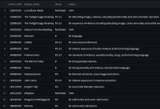
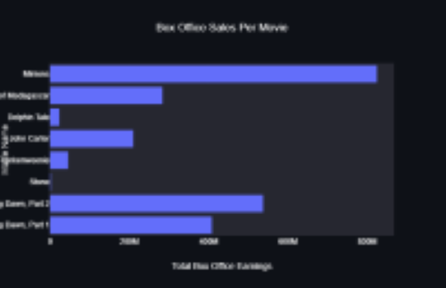

# Introduction

This chapter aims to describe the motivation, the current state of research, the overall goals, and the ethical implications that arose while preparing this project.

## Motivation

There has been a giant leap in the amount of movies being produced, especially with streaming platforms starting to create their own movies/tv shows as well. With this leap also came a drastic change in the success of movies, as the preferences and criteria for movies had changed, with respect to the consumers. With this analysis, it can be determined that the weight of past research does not necessarily continue to define what exactly makes movies and tv shows successful for the movie industry. Therefore, this paper serves to provide an analysis of the different factors that can affect movie success, with the final result being a trained model that can predict the success of a movie based on the evaluated factors. The factors that will be evaluated will be the actors, the genre, the director, the production budget, the overall revenue, and the main source of revenue (domestic, international, etc.). As streaming is the focal point of the personalization of the movie industry, there will also be an evaluation on whether these factors comply with the movie trends on certain streaming platforms, such as Netflix, Hulu, Disney+, and Amazon Prime.

As movies are an integral part of the way that people spend their leisure time, then it is worth continuing on from previous research and creating a tool that will push the industry towards a more accurate personalization of their streaming algorithms. The motivation for this area of research lies in the lack of studies for how the personalization of movie recommendations impacts the overall success of movies and/or tv shows. In order to provide insight into this gap in the research, this paper will demonstrate the creation of a movie analysis tool that will: 1) predict the success of a movie and 2) provide users with a list of movie recommendations based on their preferences for the chosen movie factors.

## Current State of the Art

This section of the research paper will be an in-depth analysis of the key points of movie research, what knowledge gap is left from prior research, the way that this research will provide further insight, and any challenges that have been made to this research/prior research.

### Past Areas of Research and Knowledge Gap

Some noteable areas of research that the movie industry is involved in is the predication of movie success. For most of the experiments conducted by other data scientists, their final deliverable was a working tool that would be able to accurately predict movies, where [@movie_success_1]'s experiments were meant to "predict the gross box office revenue to the nearest ten’s of million" and to "predict if the movie would make money, not by a specific amount, just if the budget was smaller
than the revenue from ticket sales". This tool would then be used and evaluated based on a specific percentage of accuracy in their machine learning model. Most of the research conducted has hovered at around the 60-64.7% range for accuracy of their models, and oftentimes are building off of previous research's machine learning models. Since most of the research conducted in this area is mainly built off of each other and provides only data-fueled results (nothing interactive for users to see/use), then there is a considerable amount of additional research that needs to be conducted to further understand what can affect the success of a movie.

This proposed area of research will focus on essentially the same principles, where the machine learning tool will be trained using movie data in order to provide a prediction of movie success. However, the knowledge gap that exists in this area of research is identified as the lack of an interactive application or software that users can use to run the classification of data theirselves. Essentially, a way for the machine learning model to be able to be used by more than just the researchers, but instead also public users and movie industry personnel. This is the next step that should be taken for this sector of research, as there is an increasing demand for unique and personal movie/tv show recommendations.

### Proposed Solution to Knowledge Gap

In order to deliver this need for personable movie/tv show recommendations, this research will go a bit further than previous research by linking the machine learning tool to an API (application programming interface). This API will provide an interactive interface for two sectors of potential users and will provide a simplified way for said users to access the necessary information that they need about movies. For the first sector of users, the public users, they will be able to utilize this tool to determine what predicted list of movies they will be more likely to enjoy. This can be done through by using the movie data (see Figure 1) collected to train the machine learning model, similar to the way that previous research did; the methodology involved in this process will be elaborated on later on in this paper. 

Then, once this model has been trained and tested for accuracy, it will be linked to the Streamlit API. Once this is linked, the factors needed for the model to predict movie success will be transformed into simple questions on the user-end. These questions will be plugged into the trained model, where we will save the movies *utilized* in the prediction process into cloud-managed file system. As the movies were referenced by the model to come up with the prediction rate percentage, then it can be inferred that these movies were similar enough to the chosen factors outlined by the user. This list of movies will then be condensed into a pdf document, of which the user will be able to see on the API. This pdf will be the list of movies that fit the criteria that was collected from the questions, which users will be able to download. This is a similar process for the other sector of users, the industry users, except for the ending result. The ending result for this user will be the liklihood of movie success given the certain criteria, along with some graphic visuals to demonstrate the results delivered by the machine learning model, similar to Figure 2. There will be a user portal that will distinguish whether the user wants to be a public or industry user.

### Challenges to Proposed Research

The challenges with the proposed area of research is that, similar to the results of past research, the accuracy of the machine learning model will be somewhat limited (where the accuracy is expected to be at around 64.7% or higher). This can cause skewed movie recommendations/results for the users. Additionally, as the movie industry is constantly changing and being added to (with the release of new movies and tv shows annually), then there is a risk that the trained model will expire in it's usefulness since the datasets used would be outdated. To combat these challenges, this research will focus most of it's data collection on datasets that are being continously/newly updated. For example, the IMDB dataset that contains information about movie personnel and other relevant information is updated daily. However, this runs the risk of the model becoming too slow to function, as it will have to process and go through more movies in order to get it's results. Therefore, the datasets will be stored in cache instead of the model's memory, so that the cached results and pathways can be reset with each refresh of the dataset. This way, the model will stay as relevant as possible and will not be too slow once more users are able to use the API.

## Goals of the Project

As most of the project is dedicated towards predicating movie success and providing a more unique movie experience, then the main goal is to create a simplified application that users can navigate to for either result that they desire. Therefore, the creation of an application was required, which is where Streamlit comes into play. Streamlit is an open-source Python library where data scientists can create custom web apps for machine learning and data science. Since Streamlit already contains a machine-learning algorithm library and toolkit, the implementation of the machine learning aspect with the API will be smooth. The API will then be able to be personalized to enhance the user's experience with the application. 

Additionally, this research aims to improve the accuracy rate of the machine learning model beyond previous research (research has hovered at around 64.7% for the accuracy of the model). As most of the other research has analyzed a small sample of movie data, this project will aim for a better accuracy rate by continously evaluating a bigger sample size. The chosen sample size will be set at 300-500 movies since previous research had hovered at around 100-200 movies for analysis. Since previous research used dataset from certain time periods and not continuously updated datasets (such as the IMDB, Netflix, Hulu, Disney+, and Amazon Prime datasets, which are updated either daily or monthly), then their accuracy rate would only refer to the accuracy of their model for *the chosen time period* and not for the movie industry as a whole. Since this paper will be occupying continuously updated data and will run the machine learning model each time that the dataset is updated, then this allow the training of the model to be continous as well. This continous training will allow the model to be more and more accurate with the prediction of movie success.

## Ethical Implications

As this paper relies heavily on the collection and analysis of movie data, streaming data, and the structure of the rating data, this section will outline the ethical implications that arose during the construction of this project. All of the data that is collected were from third party sources -- Opus Data, IMDB, Kaggle, and Statista. As the data was collected independently from the researchers of this paper, then the garnering of data does not have an immediate affect towards the ethical implications of the data.

However, with the contents of this data, therein lies ethical complications with the subjects being analyzed in the data. The actors, the directors, and the movie itself can be ethically violated with the results given by the data. Additionally, the groups of people that were analyzed for the rating structure can also be considered in regard to the ethics of this research, as they are being used as the basis for the analysis of the personalized component for movies. The people that leave reviews and/or contribute to the box office sales of the movies can also be noted, as they have an indirect impact on the success of movies. These three different subgroups of people are to be considered when dealing with the ethical implications of this paper.

### Information Privacy

In regard to information privacy, two out of the three different subgroups have anonymity in their contributions. The different subgroups will be categorized as the following: the sales subgroup (people who contributed to the box office sales/leave reviews that indirectly influence others to contribute to the sales), the rating subgroup (the people that make up the recommended rating for movies), and the production subgroup (the people that directly contribute to the production of the movie). For the sales and rating subgroups, they are least affected by the collection of movie data, as their data was obtained anonymously and does not contain references to their personal identity. Therefore, this section of ethical implications will not necessarily pertain to them. For the production subgroup, since their identity is taken into consideration when analyzing the movie data, then they could face repurcussions on the information that is generated by the results of this research. In order to ensure that there will not be an ethical violation for this project, there will be a disclaimer that displays before using the analysis tool. This disclaimer will reinforce the notion that this project does not have any relation to the subjects being analyzed and should not be used as a sure way to judge the production/people present in the movie data. With this disclaimer, we hope to clear any ethical violations that may arise from the analysis of the data.

### Information Accuracy

For information accuracy, two out of the three subgroups are ethically affected and should be acknowledged. The sales subgroup is affected, as the reviews that are left for movies may contain bias or a preference for certain actors or directors. As it has been proven in past research that the celebrity status of actors directly contribute to the success of movies, then it can be inferred that movies with a high celebrity presence may also garner more positive reviews, regardless of the actual production level of the movie. This can create inaccurate reviews, which can skew the data being used for this project. The rating subgroup is affected, as there are differing opinions on the certain age group that can be classified towards different movie ratings. Depending on what country and on what source, the age grouping for PG or G movies, for example, can be different. The production subgroup is not necessarily impacted by information accuracy, as their data can be verified by multiple sources, as well as the movie itself. To address the aforementioned information accuracy concerns, I primarily used data and sources that have been peer-reviewed and/or are reputable among the movie industry. For example, IMDB is a site that hosts large information on movies and is one of the more accurate sources for movie data. By using data collected from this site, the research can stay clear of using inaccurate information, thereby reducing the ethical complications that may arise.

### Potential Misuse

For the potential misuse of my results, such as the unintended consequences mentioned in the information privacy section, two out of the three subgroups are affected. For the sales subgroup, as their contributions to the revenue of a movie and/or the reviews of a movie are to be explored and analyzed with the tool, then their data could be misused if it is not analyzed accurately. With the production subgroup, as their identify is used to classify certain aspects of the data (especially for actors and directors), then there may be a misuse of the results obtained from the tool. For example, any negative correlations that are found between movie success and a certain actress or director could unintentionally create backlash for them. This could lead to detrimental consequences for the certain actress or director, which would put their use of data in jeaporady ethics-wise. For the rating subgroup, since their data is more or less widely-known and accepted, then there is a very slim chance that their data can be misused. In order to ensure that the data that has been collected does not get misused or misinterpreted, any negative links to the success of movies that are found will not be published. As this is outside of the scope of the chosen area of research, this information is irrelevant to the basis of the predicition model. Additionally, this issue will be referenced in the aforementioned disclaimer, as it is imperitive that any potential misrepresentation of the results are addressed before the use of the prediction tool.

### Algorithm or Data Bias

One of the main ethical complications that arose during the course of this research were the question of whether there was a bias in the algorithm or data collection process. As the algorithm that will be used to train the machine learning model has not been established yet, this section will be incomplete until more information can be added about the ethical implications of the chosen algorithms. However, in regard to the question of data bias, all three subgroups are directly affected. As every dataset is determined to always have some sort of bias, whether that is through the collection or the distribution of the data, then this was the case of determining which dataset contained the *least* amount of bias. This is important to the three subgroups, as all of their information will be used to during the analysis of the movie data. Therefore, any skewed results as a result of data bias would indirectly reflect badly on the people mentioned in the data, and not on the source of the data itself. To combat this, this research will only occupy movie data that is obtained from reputable sources and/or third-party data collection sources. This is evident in the way that the chosen movie data was obtained, where the Opus Data data collection company provided this research with datasets about the movie production sales and personnel. Opus Data, a database management system, is the host for the datasets collected by the website *The Numbers*, "a free resource for industry professionals, the investment community, and movie fans to track business information on movies", with their site being "the largest freely-available database of movie business information on the web" [@the_numbers]. Kaggle, a subsidiary of Google LLC, provided the streaming data for Netflix, Hulu, Disney+, and Amazon Prime by web scraping the information directly from their respective websites. Since Kaggle is a platform for the community of data scientists to share and view different data, then this source has the advantage of being constantly peer-reviewed through the use of upvotes and downvotes. The chosen datasets are the more 'popular' data available and contained a large ratio of upvotes to downvotes, as well as numerous shares and downloads. Statista, "a leading provider of market and consumer data" was used to get information on the demographics of users that contributed to the movie sales/revenue. This is one of the more reliable statistics website, as "over 1,100 visionaries, experts and doers continuously reinvent Statista, thereby constantly developing successful new products and business models" [@statista]. As all of these sources are constantly updated, heavily peer-reviewed, and contain a low risk of data bias, then they would mitigate any ethical complications that would arise from data bias.

# Related work

add the related work section here.

# Method of approach

add the method of approach here.

# Experiments

add the experiments here.

## Experimental Design

add the experimental design here.

## Evaluation

## Threats to Validity

# Conclusion

add the conclusion here.

## Summary of Results

## Future Work

## Future Ethical Implications and Recommendations

add future ethics concerns here.

## Conclusions

# References

::: {#refs}
:::