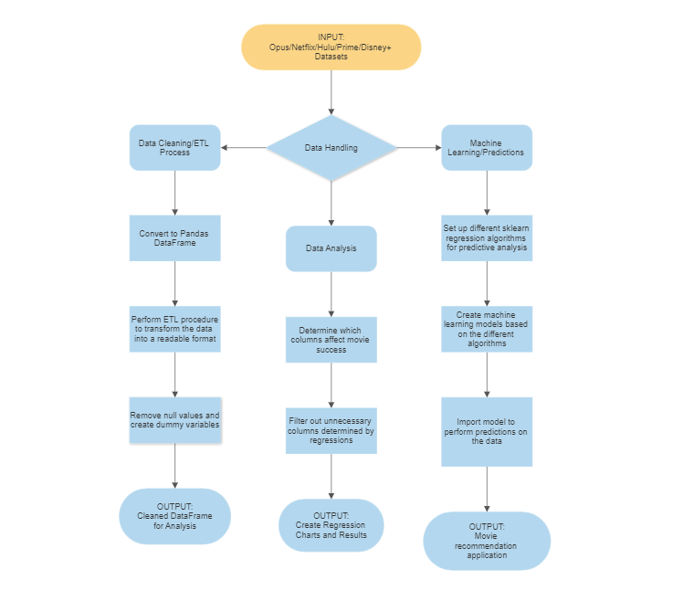
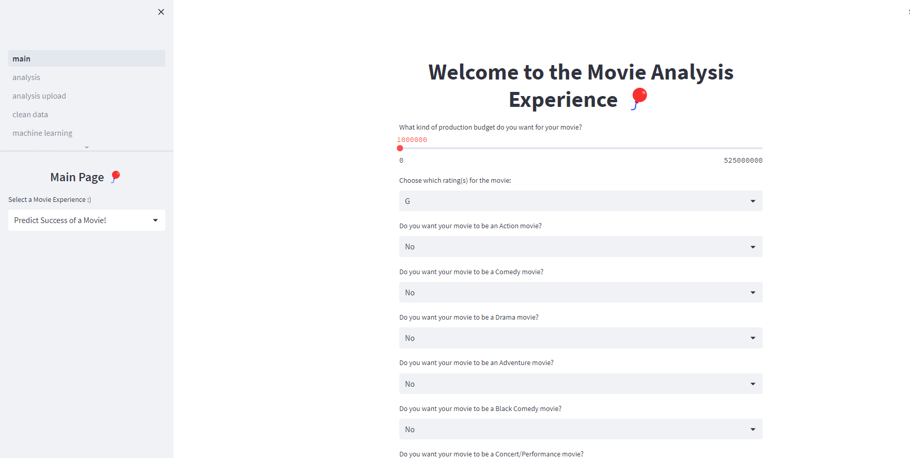

# Introduction

This chapter aims to describe the motivation, the current state of research, the overall goals, and the ethical implications that arose while preparing this project.

## Motivation

There has been a giant leap in the amount of movies being produced, especially with streaming platforms starting to create their own movies/tv shows as well. With this leap also came a drastic change in the success of movies, as the preferences and criteria for movies had changed, with respect to the consumers. With this analysis, it can be determined that the weight of past research does not necessarily continue to define what exactly makes movies and tv shows successful for the movie industry. Therefore, this paper serves to provide an analysis of the different factors that can affect movie success, with the final result being a trained model that can predict the success of a movie based on the evaluated factors. The factors that will be evaluated will be the actors, the genre, the director, the production budget, the overall revenue, and the main source of revenue (domestic, international, etc.). As streaming is the focal point of the personalization of the movie industry, there will also be an evaluation on whether these factors comply with the movie trends on certain streaming platforms, such as Netflix, Hulu, Disney+, and Amazon Prime.

As movies are an integral part of the way that people spend their leisure time, then it is worth continuing on from previous research and creating a tool that will push the industry towards a more accurate personalization of their streaming algorithms. The motivation for this area of research lies in the lack of studies for how the personalization of movie recommendations impacts the overall success of movies and/or tv shows. In order to provide insight into this gap in the research, this paper will demonstrate the creation of a movie analysis tool that will: 1) predict the success of a movie and 2) provide users with a list of movie recommendations based on their preferences for the chosen movie factors.

## Current State of the Art

This section of the research paper will be an in-depth analysis of the key points of movie research, what knowledge gap is left from prior research, the way that this research will provide further insight, and any challenges that have been made to this research/prior research.

### Past Areas of Research and Knowledge Gap

Some noteable areas of research that the movie industry is involved in is the predication of movie success. For most of the experiments conducted by other data scientists, their final deliverable was a working tool that would be able to accurately predict movies, where [@movie_success_1]'s experiments were meant to "predict the gross box office revenue to the nearest ten’s of million" and to "predict if the movie would make money, not by a specific amount, just if the budget was smaller
than the revenue from ticket sales". This tool would then be used and evaluated based on a specific percentage of accuracy in their machine learning model. Most of the research conducted has hovered at around the 60-64.7% range for accuracy of their models, and oftentimes are building off of previous research's machine learning models. Since most of the research conducted in this area is mainly built off of each other and provides only data-fueled results (nothing interactive for users to see/use), then there is a considerable amount of additional research that needs to be conducted to further understand what can affect the success of a movie.

This proposed area of research will focus on essentially the same principles, where the machine learning tool will be trained using movie data in order to provide a prediction of movie success. However, the knowledge gap that exists in this area of research is identified as the lack of an interactive application or software that users can use to run the classification of data theirselves. Essentially, a way for the machine learning model to be able to be used by more than just the researchers, but instead also public users and movie industry personnel. This is the next step that should be taken for this sector of research, as there is an increasing demand for unique and personal movie/tv show recommendations.

### Proposed Solution to Knowledge Gap

In order to deliver this need for personable movie/tv show recommendations, this research will go a bit further than previous research by linking the machine learning tool to an API (application programming interface). This API will provide an interactive interface for two sectors of potential users and will provide a simplified way for said users to access the necessary information that they need about movies. For the first sector of users, the public users, they will be able to utilize this tool to determine what predicted list of movies they will be more likely to enjoy. This can be done through by using the movie data (see Figure 1) collected to train the machine learning model, similar to the way that previous research did; the methodology involved in this process will be elaborated on later on in this paper. 

Then, once this model has been trained and tested for accuracy, it will be linked to the Streamlit API. Once this is linked, the factors needed for the model to predict movie success will be transformed into simple questions on the user-end. These questions will be plugged into the trained model, where we will save the movies *utilized* in the prediction process into cloud-managed file system. As the movies were referenced by the model to come up with the prediction rate percentage, then it can be inferred that these movies were similar enough to the chosen factors outlined by the user. This list of movies will then be condensed into a pdf document, of which the user will be able to see on the API. This pdf will be the list of movies that fit the criteria that was collected from the questions, which users will be able to download. This is a similar process for the other sector of users, the industry users, except for the ending result. The ending result for this user will be the liklihood of movie success given the certain criteria, along with some graphic visuals to demonstrate the results delivered by the machine learning model, similar to Figure 2. There will be a user portal that will distinguish whether the user wants to be a public or industry user.

### Challenges to Proposed Research

The challenges with the proposed area of research is that, similar to the results of past research, the accuracy of the machine learning model will be somewhat limited (where the accuracy is expected to be at around 64.7% or higher). This can cause skewed movie recommendations/results for the users. Additionally, as the movie industry is constantly changing and being added to (with the release of new movies and tv shows annually), then there is a risk that the trained model will expire in it's usefulness since the datasets used would be outdated. To combat these challenges, this research will focus most of it's data collection on datasets that are being continously/newly updated. For example, the IMDB dataset that contains information about movie personnel and other relevant information is updated daily. However, this runs the risk of the model becoming too slow to function, as it will have to process and go through more movies in order to get it's results. Therefore, the datasets will be stored in cache instead of the model's memory, so that the cached results and pathways can be reset with each refresh of the dataset. This way, the model will stay as relevant as possible and will not be too slow once more users are able to use the API.

## Goals of the Project

As most of the project is dedicated towards predicating movie success and providing a more unique movie experience, then the main goal is to create a simplified application that users can navigate to for either result that they desire. Therefore, the creation of an application was required, which is where Streamlit comes into play. Streamlit is an open-source Python library where data scientists can create custom web apps for machine learning and data science. Since Streamlit already contains a machine-learning algorithm library and toolkit, the implementation of the machine learning aspect with the API will be smooth. The API will then be able to be personalized to enhance the user's experience with the application. 

Additionally, this research aims to improve the accuracy rate of the machine learning model beyond previous research (research has hovered at around 64.7% for the accuracy of the model). As most of the other research has analyzed a small sample of movie data, this project will aim for a better accuracy rate by continously evaluating a bigger sample size. The chosen sample size will be set at 300-500 movies since previous research had hovered at around 100-200 movies for analysis. Since previous research used dataset from certain time periods and not continuously updated datasets (such as the IMDB, Netflix, Hulu, Disney+, and Amazon Prime datasets, which are updated either daily or monthly), then their accuracy rate would only refer to the accuracy of their model for *the chosen time period* and not for the movie industry as a whole. Since this paper will be occupying continuously updated data and will run the machine learning model each time that the dataset is updated, then this allow the training of the model to be continous as well. This continous training will allow the model to be more and more accurate with the prediction of movie success.

## Ethical Implications

As this paper relies heavily on the collection and analysis of movie data, streaming data, and the structure of the rating data, this section will outline the ethical implications that arose during the construction of this project. All of the data that is collected were from third party sources -- Opus Data, IMDB, Kaggle, and Statista. As the data was collected independently from the researchers of this paper, then the garnering of data does not have an immediate affect towards the ethical implications of the data.

However, with the contents of this data, therein lies ethical complications with the subjects being analyzed in the data. The actors, the directors, and the movie itself can be ethically violated with the results given by the data. Additionally, the groups of people that were analyzed for the rating structure can also be considered in regard to the ethics of this research, as they are being used as the basis for the analysis of the personalized component for movies. The people that leave reviews and/or contribute to the box office sales of the movies can also be noted, as they have an indirect impact on the success of movies. These three different subgroups of people are to be considered when dealing with the ethical implications of this paper.

### Information Privacy

In regard to information privacy, two out of the three different subgroups have anonymity in their contributions. The different subgroups will be categorized as the following: the sales subgroup (people who contributed to the box office sales/leave reviews that indirectly influence others to contribute to the sales), the rating subgroup (the people that make up the recommended rating for movies), and the production subgroup (the people that directly contribute to the production of the movie). For the sales and rating subgroups, they are least affected by the collection of movie data, as their data was obtained anonymously and does not contain references to their personal identity. Therefore, this section of ethical implications will not necessarily pertain to them. For the production subgroup, since their identity is taken into consideration when analyzing the movie data, then they could face repurcussions on the information that is generated by the results of this research. In order to ensure that there will not be an ethical violation for this project, there will be a disclaimer that displays before using the analysis tool. This disclaimer will reinforce the notion that this project does not have any relation to the subjects being analyzed and should not be used as a sure way to judge the production/people present in the movie data. With this disclaimer, we hope to clear any ethical violations that may arise from the analysis of the data.

### Information Accuracy

For information accuracy, two out of the three subgroups are ethically affected and should be acknowledged. The sales subgroup is affected, as the reviews that are left for movies may contain bias or a preference for certain actors or directors. As it has been proven in past research that the celebrity status of actors directly contribute to the success of movies, then it can be inferred that movies with a high celebrity presence may also garner more positive reviews, regardless of the actual production level of the movie. This can create inaccurate reviews, which can skew the data being used for this project. The rating subgroup is affected, as there are differing opinions on the certain age group that can be classified towards different movie ratings. Depending on what country and on what source, the age grouping for PG or G movies, for example, can be different. The production subgroup is not necessarily impacted by information accuracy, as their data can be verified by multiple sources, as well as the movie itself. To address the aforementioned information accuracy concerns, I primarily used data and sources that have been peer-reviewed and/or are reputable among the movie industry. For example, IMDB is a site that hosts large information on movies and is one of the more accurate sources for movie data. By using data collected from this site, the research can stay clear of using inaccurate information, thereby reducing the ethical complications that may arise.

### Potential Misuse

For the potential misuse of my results, such as the unintended consequences mentioned in the information privacy section, two out of the three subgroups are affected. For the sales subgroup, as their contributions to the revenue of a movie and/or the reviews of a movie are to be explored and analyzed with the tool, then their data could be misused if it is not analyzed accurately. With the production subgroup, as their identify is used to classify certain aspects of the data (especially for actors and directors), then there may be a misuse of the results obtained from the tool. For example, any negative correlations that are found between movie success and a certain actress or director could unintentionally create backlash for them. This could lead to detrimental consequences for the certain actress or director, which would put their use of data in jeaporady ethics-wise. For the rating subgroup, since their data is more or less widely-known and accepted, then there is a very slim chance that their data can be misused. In order to ensure that the data that has been collected does not get misused or misinterpreted, any negative links to the success of movies that are found will not be published. As this is outside of the scope of the chosen area of research, this information is irrelevant to the basis of the predicition model. Additionally, this issue will be referenced in the aforementioned disclaimer, as it is imperitive that any potential misrepresentation of the results are addressed before the use of the prediction tool.

### Algorithm or Data Bias

One of the main ethical complications that arose during the course of this research were the question of whether there was a bias in the algorithm or data collection process. As the algorithm that will be used to train the machine learning model has not been established yet, this section will be incomplete until more information can be added about the ethical implications of the chosen algorithms. However, in regard to the question of data bias, all three subgroups are directly affected. As every dataset is determined to always have some sort of bias, whether that is through the collection or the distribution of the data, then this was the case of determining which dataset contained the *least* amount of bias. This is important to the three subgroups, as all of their information will be used to during the analysis of the movie data. Therefore, any skewed results as a result of data bias would indirectly reflect badly on the people mentioned in the data, and not on the source of the data itself. To combat this, this research will only occupy movie data that is obtained from reputable sources and/or third-party data collection sources. This is evident in the way that the chosen movie data was obtained, where the Opus Data data collection company provided this research with datasets about the movie production sales and personnel. Opus Data, a database management system, is the host for the datasets collected by the website *The Numbers*, "a free resource for industry professionals, the investment community, and movie fans to track business information on movies", with their site being "the largest freely-available database of movie business information on the web" [@the_numbers]. Kaggle, a subsidiary of Google LLC, provided the streaming data for Netflix, Hulu, Disney+, and Amazon Prime by web scraping the information directly from their respective websites. Since Kaggle is a platform for the community of data scientists to share and view different data, then this source has the advantage of being constantly peer-reviewed through the use of upvotes and downvotes. The chosen datasets are the more 'popular' data available and contained a large ratio of upvotes to downvotes, as well as numerous shares and downloads. Statista, "a leading provider of market and consumer data" was used to get information on the demographics of users that contributed to the movie sales/revenue. This is one of the more reliable statistics website, as "over 1,100 visionaries, experts and doers continuously reinvent Statista, thereby constantly developing successful new products and business models" [@statista]. As all of these sources are constantly updated, heavily peer-reviewed, and contain a low risk of data bias, then they would mitigate any ethical complications that would arise from data bias.

# Related work

This section will explore the literature behind what components of the movie industry influence the revenue that movies generate at the box office and on streaming platforms. More specifically, whether actors, reviews, production budget, and the digitization of movies will affect the overall success of a movie. With the rise of streaming platforms and the production of multi-celebrity featured appearances in film, this type of analysis is an important area of study towards the economics of the movie industry. This analysis will also help to determine what data proponents will be focused on during the methodology section of this paper.

### The Power of Stars: Do Star Actors Drive the Success of Movies?

In Elberse’s paper [@elberse], they research the question of whether the involvement of stars is critical to the success of motion pictures. That notion appears to be the driving force behind movie studios, which frequently award performers multimillion dollar salaries. Using an event analysis that examines the effects of more than 1200 casting announcements on trading behavior in a simulated and actual stock market environment, this research provides insight into the returns on this investment (Elberse p.102). The author reinforces the concept that the presence of stars influences the earnings of films outside of the theater and also offers insight into the size of this effect. For instance, according to the projections, stars generate $3 million in theatrical income on average. The author additionally looks at the factors that affect the magnitude of stars in a cross-sectional examination of the group dynamics literature. The author demonstrates that with a stronger cast, among other factors, a newly hired celebrity with either a history of box office triumphs or a good creative reputation will have a greater impact. Finally, in a follow-up study, the author does not discover that the value of the film firms that release the movies increases when stars are involved, therefore there is insufficient evidence to draw the conclusion that stars add more value than they capture. The author addresses the movie industry's managers' ramifications.

Previous literature about the economic impact of star power on movie revenue has been mixed, to say the least. Some research (Austin 1989; De Vany and Walls 1999; Litman 1983; Litman and Ahn 1998; Ravid 1999) has not shown a correlation between earnings and talent involvement. Others have found strong evidence that a film's likely cumulative, weekly, or opening-week sales rise with the rank of the star talent connected with it (Elberse p.103). In their study of Wall Street equity research analysts, Groysberg, Polzer, and Elfenbein (2006) concluded that the movie industry benefits from having people who perform well on an individualized basis. They point out that while stars can contribute directly to the team's performance, they can also have an indirect impact on success, such as raising the group's perception among outsiders. The latter finding is suitable in the context of movies. The two reputations that, in general, can be the source of a star's power are their: economic reputation, which is generated from their box office success, and their artistic reputation, which is obtained from the acclaim of critics or peers (Delmestri, Montanan, and Usai 2005). Ravid's (1999) measures are directly related to these two reputations. Some studies have demonstrated that a star's past box office performance is a good predictor of his or her potential in the future (e.g., Lampel and Shamsie 2003; Litman and Kohl 1989; Ravid 1999; Sochay 1994)1 and is a valuable resource for studio executives (Chisholm 2004). [@elberse] adds to these mixed reviews by testing both of the different dimensions to a star in their hypothesis (H1): The impact of a star on a film's box office revenues positively depends on (a) the star's economic reputation, reflected by his or her historical box office performance, and (b) the star's artistic reputation (Elberse p. 104).

One of the ways that the author used to describe the variables is through the event study methodology. In several areas of business research, event studies are a common methodology (e.g., Campbell, Lo, and MacKinlay 1996). Event studies have been employed in marketing to comprehend the effects of, among other things, company name changes (Horsky and Swynge-dow 1987), new product introductions (Chaney, Devinney, and Winer 1991), brand extensions (Lane and Jacobson 1995), celebrity endorsements (Agrawal and Kamakura 1995), and the addition of online channels (Geyskens, Gielens, and Dekimpe 2002) on firm valuation. In this case, an event study approach has benefits over the field's previous research. The event research methodology, first and foremost, enables a comparison of a movie's anticipated performance prior to and following the casting announcement (Elberse p.110). Second, the event research approach makes it possible to examine the influence of a certain actor or actress when announcements only involve one famous person. Additionally, these findings are consistent with the 0-rings theory, which asserts that in order to produce a work of unified excellence, every input must perform at least to a certain degree of dedication and expertise [@elberse]. This idea reflects a fundamental characteristic of multiplicative production processes, namely that the quality of an output depends on all inputs meeting a certain standard (Caves 2003; Kremer 1993).

In [@elberse], the main data that is used in their research comes from the HSX. The HSX, an online market simulation that focuses on the film business, is the main source of data. It had about 500,000 registered users ("traders") as of January 2005, a frequent trader group of over 80,000 accounts, and about 19,500 daily unique log-ins. By strategically exchanging MovieStocks and StarBonds, among other things, new users can boost the value of their portfolio after receiving 2 million "Hollywood dollars" (abbreviated as "H$2 million"). Although the trading community is fairly diverse, the most active traders are typically avid users and early adopters of entertainment products, particularly for movies. All casting announcements that appeared in the HSX Market Recap report between November 2001 and January 2005 make up the sampling frame for this study. Five notifications that mentioned the same Movie- Stock and appeared within two weeks of one another were disregarded in order to avoid difficulties with the event study methodology, leaving a total of 1258 announcements. Together, they cover 602 stars from 496 films. [@elberse] considered each of the actors and actresses listed on the StarBond market to be a "star" for the purposes of this study, as they stand out from the multitudes of dreamers without a profession in film thanks to their presence on the StarBond market.
The variables used for this study are: star economic history, star artistic history, cast count, cast economic history, and cast artistic history. Star economic history is measuring the ‘average box office revenues for the star’s five latest movies at the time of the announcement’ [@elberse]. Cast count measures the number of other cast members at the time of a star’s announcement, as this has been studied extensively showing an effect on the movie’s overall revenue success – such as Natalie Portman’s joining the cast of Cold Mountain. Star artistic history measures the ‘total number of Oscars and Golden Globes and nominations for the star in the five years before the announcement’ – ergo, whether they are considered a breakout star or have acclaimed recognition for their talent prior to the emergence of the movie [@elberse]. Cast economic history measures the average of each cast member’s box office revenues for their last five movies at the time of their announcement; whether the stars have a demonstrated track record of fostering more movie sales in prior work (Elberse, p. 109). The cast artistic history measures the average number of Oscars/Golden Globs/nominations for the cast members in the five year prior to the movie announcement; whether there is an established strong cast prior to the joining of the actor/actress to the movie.

The results of this study can tell us a lot about the research question of the paper. The author used an event research approach to tackle this problem and examined the effects of more than 1200 casting announcements on both simulated and actual stock market trading. Strong evidence was found by the author to support the idea that star involvement does, in fact, increase movie sales; more specifically, the findings imply that stars may be "worth" several million dollars in revenue. The stars' prior performances in an artistic and financial sense (expressed as box office success and awards or nominations collected, respectively), as well as the quantity and prior performances of other star cast members, were also found to be significant determinants of the magnitude of that effect (Elberse, p.118). The author was unable to discover evidence to support the claim that celebrities also affect the value of movie studios or the media conglomerates to which they belong, despite the fact that stars appear to have an impact on film-level profits.

The conclusion reached by this paper is that the participation of stars in movies positively affects the revenue generated by the box office, which is line with previous research and conventional wisdom. This study is an initial dive into the realm of research in star power and the affect that it has on the movie industry, yet they were unable to support a significant relationship between stars and movie revenue due to the lack of ‘real’ evidence. Nevertheless, this study’s insights could help movie industry professionals reconsider their talent acquisition process, especially as it relates to the revenue that they hope to generate for their movie. One way that they could reconsider the talent search process is to not place so much emphasis on obtaining an A-list star, as the results of this study show that they have a barely distinguishable positive influence on movie revenue unless there is an independently strong cast present. Therefore, it could be in the best interest to focus on building a strong cast of talented individuals prior to searching for an A-lister to heighten their movie sales.

Some of the potential shortcomings of this paper are that the analysis is done on data that is not ‘real’. Ergo, where the data was collected off of projected movie sales, stars, budgets, and revenues from the HSX stratosphere. This could cause some of the results to be skewed when compared with real-world actual projections. Additionally, there is not an analysis done on the impact that stars have on movie revenues using movie-level profit data. Since this area of research is important to the basis of the research question, then this also plays into the slightly ‘bad’ collection of data. This study does provide a good basis for the research into star power and movie revenue, but it also does not provide a reasoning for why some stars are simply bigger than others. Whether that is because they have superior acting skills, perceived better marketing strategies, or through other endorsements/commitments. This could potentially be addressed in future research.

### Estimating the Costs of Standarization: Evidence from the Movie Industry

The transfer of an industry from its existing technology standard to a more efficient one under the influence of network effects is the subject of this article. Adoption could be ineffectively delayed if the new technology is incompatible with the existing infrastructure. The author calculates the amount of excess inertia that would result from a move from 35mm film to digital for movie distribution and exhibition. The author describes and calculates a dynamic game of theaters adopting digital hardware and distributors supplying digital movies. According to the findings in this paper, Caoui [@caoui] concluded that excess inertia reduces surplus by 19% compared to under coordination, according to counterfactual simulations, and adoption externalities account for 29% of the surplus loss. Studying the transition from the 35mm film standard to digital cinema in France between 2005 and 2013 is the main focal point of this paper.

The identification and measurement of network effects have been the main topics of earlier empirical research on technology adoption under network effects. Due to the reflection issue mentioned in Manski, identification is typically not simple (1993,1995). In his 2019 article, Rysman explores the methods used to address this problem and discusses it in the specific context of network effects. Gowrisankaran and Stavins (2004) study ACH adoption by banks; Tucker (2008) studies video-messaging adoption by a bank's employees; Goolsbee and Klenow (1999) study adoption of home computers. Recent contributions use regional or individual-specific exogenous shifters of network size to identify direct network effects. The probable contribution of ISP differentiation in the original failure to agree on a standard for 56K modems is discussed by Augereau, Greenstein, and Rysman (2006). In their 2006 study, Ackerberg and Gowrisankaran look at the welfare effects of bank and customer subsidies in ACH adoption. Ryan and Tucker (2012) investigate the uptake of video calling inside a multinational company and simulate potential diffusion trajectories for network seeding strategies. Lee (2013) investigates how exclusivity agreements between software developers and hardware platforms affect welfare.

This paper adds to the body of knowledge by examining innovation and technology adoption using dynamic games. The research first assesses how externalities and business heterogeneity affect the adoption of new technologies. Second, this study emphasizes the significance of modeling and monitoring adoption within the company (e.g., at the unit of capital level). Multi-homing, or the concurrent application of two technologies across a company's capital stock, is a crucial component of a wide range of businesses. This article adds to the body of empirical research on the film industry [@caoui]. In order to assess how the diffusion path differs from the social optimum, the current research uses the changeover from film to digital as an example of a technology standard switch. By offering a case study of excessive inertia in technology adoption and by separating the sources of surplus loss, the current research adds to this body of literature.

This paper makes use of four brand-new datasets: (1) a panel documenting theater adoption of digital projectors at the screen level as well as details on regional market conditions and theater characteristics; (2) a time series of digital projector prices; (3) a time series documenting the percentage of movies distributed in digital; and (4) estimates of the average distribution cost curves (printing, shipping, and storage costs per movie print) under the film and digital technologies [@caoui]. A panel describing theatrical digital adoptions makes up the bulk of the dataset. The European Cinema Yearbooks, which are published by Media Salles, and a private digital platform called Cinego's online database were the two sources used to compile this information. 17 Both sources are open to the public and offer glimpses of the French digital exhibition market at various times between June 2005 and March 2013. Five dates from the Cinego database and thirteen dates total are taken from the Cinema Yearbooks. Every current theater's acquisition of digital projectors is known for each of the 18 observation dates. The panel began operating aperiodically in 2008 and ends before the diffusion is finished in 2014. To ensure relative periodicity in the sample, five periods are dropped (6 months).

The primary adoption panel dataset is supplemented by two additional datasets. The first can be found at the French National Center for Cinematography (CNC hereafter). Between 2005 and 2015, the CNC dataset offers a wealth of data on the features of local movie theaters, the size of the local market, and the proportion of digitally available films. More specifically, this annual dataset includes: (1) lists of all theaters that are currently open; (2) information about each theater's number of screens, seats, address, theater chain or individual owner, and whether it is an art house; (3) market population (categorical) at the level of urban/rural unit (defined below); and (4) the proportion of films that have been released in digital format (distributed partially or entirely in digital). The second supplementary dataset, also acquired from the European Audiovisual Observatory, offers time-series data on the price of purchasing a digital projector. 18 In particular, the time-series for the hardware adoption cost is created by adding (2) ancillary charges to (1) the cost of a digital projector (net of VPF contributions). A survey of projector manufacturers served as the basis for the price time series for digital projectors. Due to nondisclosure agreements between theaters and manufacturers, the actual prices paid by certain cinemas are not known to the general public. The "list" price of digital projectors, often known as the MSRP (manufacturer's suggested retail price), is assumed to be represented by this time-series.

The four type used (movie theater, market demand, digital projector, and movie distribution) for the different variables can be described in the following ways. The type ‘movie theaters’ is assigned to the variables digital screens (number of screens digitzed over time), screens (total number of screens), seats (seats per screen), art house (binary variable to check if it is an art house theater), chain (identifies if the movie theater is a chain), and competitors screens (number of screens from a rival in the local market) (Caoui p. 38). The type ‘market demand’ is assigned to the variables region (identifier for the regions used in the study) and market size (identifier for the different markets in Paris being studied) [@caoui]. The type ‘digital projector’ covers the variable adoption costs, which is the cost of buying the bare-minimum digital projector. The type ‘movie distribution’ relates to the variable digital movies, which is the total share of movies that were released in a digital form instead of a film format.

The findings point to the potential benefit of regulatory intervention in network industries, particularly in terms of coordinating businesses' adoption of cutting-edge technology. Additionally, the best tool (between adoption subsidies and standard-setting committees) relies on the reason for the inefficiency as well as the market segment that has too much inertia. According to the data, the upstream distribution market has the most inertia in the case of digital cinema.
The current study can be expanded in a number of ways, one of which is significant. It might be possible to relax the presumption that the digital manufacturing industry is competitive ("non-sponsored" technology) [@caoui]. In digital manufacturing, oligopoly or a monopoly may assist match the best diffusion path with the market outcome.

The author calculates the benefits of theaters switching to digital displays using information on theater adoption decisions and the extensive cross-sectional variance in theater and market parameters. The estimated model is used to determine how much excess inertia there is in the switch to digital. The author simulates two counterfactuals: in the first, a planner maximizes aggregate theater profits while taking into account the reaction function of upstream distributors; in the second, the planner imposes coordination on upstream digital distribution while still maximizing aggregate theater profits [@caoui]. The counterfactuals demonstrate that market forces did not offer sufficient inducements for a successful transition from 35mm to digital. Compared to when there is coordination, industry profits are lower under the non-cooperative market outcome. Additionally, excess inertia in the upstream distribution market is responsible for two-thirds of the surplus loss, while adoption externalities in the downstream exhibition market are responsible for the remaining one-third.

### The Economics of Movies (revisited): A Survey of Recent Literature

Only a few academic studies on the economics of the film industry had been published twenty years prior. This drastically altered during the first ten years of the new century, and numerous research started to appear in journals for both related disciplines and the study of economics. This tendency has persisted over the succeeding and most recent ten years, and the literature on the "economics of movies" has fully developed during this time. While disciplines like economics and marketing continue to do the most work, more recent data-oriented disciplines are increasingly focusing on the market and its wealth of rich and easily accessible data. This study aims to provide a succinct but thorough evaluation of contemporary literature on this endlessly fascinating sector of the movie industry. Though this paper does not contain new research, it will combine all relevant new research into a comprehensive review.

The previous literature that this work references had studies on movie microeconomics (demand and supply sides), movie macroeconomics (for where the entire industry is considered), and other work related to the movie industry (such as TV, video-on-demand industries, etc.). For demand, this included studies modeling box office outcomes, which are commonly referred to as ‘hedonic’ demand models as they seek to decompose the revenue of films into quantifiable characteristics [@mckenzie] (McKenzie 2022 p. 6).

Research efforts have also been made to better understand the behavioral factors that produce heavy-tailed distributions that are related to blockbusters, which complements research-related heavy-tailed distributions. 8 According to Moretti (2011), social learning shocks are more pronounced in movies aimed at teenagers, and he eliminates network externalities by utilizing data on weather shocks. Gilchrist and Sands (2016) contend, however, that demand momentum is not just influenced by social learning but also by preferences for shared experiences (i.e., network effect) [@mckenzie]. Additionally, Cabral and Natividad (2016a) contend that network externalities, also known as social consumption value, play a significant effect. Regardless of the method, blockbusters have been progressively significant over the past century for the performance of the industry (McKenzie & Smirnov, 2018). (Pokorny & Sedgwick, 2010).

Numerous approaches have been used to continue investigating the effects of professional critics' reviews (Carrillat et al., 2018). For instance, research have examined how advertising influences or is affected by critical evaluations (Moon, Bergey, and Lacobucci, 2010). It has also been thought that the absence of reviews before to a movie's release could establish the causal connection (Brown et al., 2012, 2013). Related research examines the extent to which racial bias may affect box office receipts as well as whether genres linked to literary content react more to critics' reviews (Koschat, 2012). (Fowdur et al., 2012) [@mckenzie]. Others investigate if reviews have a greater influence during uncertain economic times (Dhar & Weinberg, 2016). In addition to the effect on box office results, additional study (Chen et al., 2012) explores how the parent corporation of the studio is impacted by critic reviews and whether it has any influence on the reviews of related critics (Dellavigna and Hermle, 2017).
Academic research on the economic impact of celebrities and other off-screen talent has produced conflicting results (Hofmann et al., 2017; Nelson & Glotfelty, 2012). The range of ways that variables measuring these inputs have been operationalized is one obvious explanation. Other studies use prior performance in terms of box office results and/or accolades, while several research use industry sources (such as Hollywood Hot Lists or IMDb's StarMeter). Studies also vary in terms of how they approach concepts. For instance, some research (Mannor et al., 2016; Skilton, 2009; Wirtz et al., 2016) frame it from a "resource-based standpoint," while others adopt a "brand equity" viewpoint (Luo et al., 2010; Mathys et al., 2016). Although there may be some overlap, these strategies (Griffith et al., 2017) [@mckenzie].

The substance of a movie can be inferred from its classification rating by looking at whether it has adult themes. In models where box office revenues (or another variable, such critic evaluations), are the dependent variable of interest, researchers frequently include this as a type of control variable. By analyzing how classification ratings are created and how they affect customer demand and/or industrial supply decisions, several authors have attempted to get a deeper knowledge of classification ratings. A number of works in this field expand on prior investigations that described the "R-rating conundrum." 12 This explains why studios keep making R-rated movies, even though they have lower box office success.
Industry economics is typically referred to as a subset of microeconomics. However, some studies look at subjects more pertinent to the overall sector and its operations in the literature pertaining to the motion picture industry. Even though there have been fewer of these research overall, there have been some fascinating findings that shed light on challenges with aggregated demand and supply. 17 For instance, Hand and Judge (2011) look at the underlying seasonality that has previously been investigated using product-level data using aggregated data, while Yamamura (2009) and Sisto and Zanola (2010) investigate Becker and Murphy's rational addiction model using aggregated movie attendance data. Kim (2009) and Gil and Gutierrez-Navratil (2017) have researched the competition between going to the movies and other cultural pursuits.

Academic research will almost certainly follow given the seismic shift toward various streaming providers. Research on subjects like catalog content, bundling, desire to pay, and the connections with piracy are just the tip of the iceberg as of now. While some of these studies are in line with previous and current research on other formats (such as DVD and TV), other research is brand-new and particular to these emerging businesses.

The studies on movies that have been published in the top economics journals offer some insight into how academics with research interests in this area could choose to target the top journals in the discipline. More specifically, these publications tend to focus on broader economic phenomena rather than movies per se. In that regard, intriguing research inquiries must go beyond the boundaries of the film industry. Of course, good facts and solid empirical research are necessary in addition to having the proper question. Researchers using data from the film industry must continue to guarantee that their work aligns with the recent focus in society.

# Method of approach

## Introduction

This section of the paper will focus on the method of approach towards solving for the research question posed, where movies are being evaluated to determine what features make them successful. In order to determine the specific features that effect movies, stepwise regressions were ran using different data analysis tools. Once these features were identified, the data was analyzed by running multiple linear regressions in order to identify patterns in the data within the chosen features. Following this analysis, the data ran through different predictive regression algorithms and saved into different machine learning models, which were sorted based on accuracy. These trained models were then used to implement a movie recommendation application that is based on the predictions generated by the machine learning model.

## Data Collection and Validation

In order to gather relevant movie data for analysis, the following sources were used: The Numbers API: Opus, OMDB API, Kaggle, and IMDB. These websites/API's are a host for multiple datasets used for predictive analysis and have been highly regarded among other data scientists. The different data obtained from these sources will be described below. 

The Numbers is a free website that offers its resources to industry professionals, the investment community, and movie fans. These resources consist of tracking business information on movies, where the information gathered on these movies comes from either other free movie information sites (such as IMDB) or from sources in the industry (movie studios) [@the_numbers]. Through these resources, The Numbers is able to continously update their movie data, as they receive their information/updates on a daily basis. The Numbers collaborates with Opus Data to provide a movie API, where users of this API can obtain updated movie data. In order to not go outside of the scope of this project, this research uses the educational data provided by the API, where this package contains relevelant movie information for 1,900 movies spanning from 2006 to 2018. The dataset contains information on movies for the following: movie name, production year, movie ID, production budget, domestic box office, international box office, rating, creative type, source, production method, genre, sequel, and running time.

As most of the information in this dataset is numerical, then it was decided that obtaining more textual data was necessary to improve the predictive nature of the proposed model. Therefore, Kaggle was used to obtain data on the following streaming services: Netflix, Hulu, Disney +, and Amazon Prime. Kaggle is a free website that offers over 50,000 public datasets and 400,000 public notebooks that are used to perform data analysis tasks and data science work [@kaggle]. The specific datasets that were used contained information directly from Netflix, Hulu, Disney +, and Amazon Prime through webscraping done by other Kaggle users. This involves automating a program to visit a website, locating information through the website's HTML tags, and saving the data in a dataset. The chosen Kaggle dataset for Netflix contained all of the movies and TV shows (over 8,000) that were available on Netflix as of October 18th, 2021, with new updates to the data occuring Quarterly. The chosen Kaggle dataset for Hulu contains all of the movies and TV shows available to users, with the data also being updated Quarterly. The chosen Kaggle dataset for Amazon Prime contains information on close to 10000 movies or TV shows available on their platform, with the data being updated Monthly. The chosen Kaggle dataset for Disney+ contains information on 1300 movies or TV shows, with the update to the data occuring quarterly. All of these datasets contain information on the following features of a movie: show ID, type, title, director, cast, country, date added, release year, rating, and duration, listed in (genre), and description.

In order to display relevant information about movies for the predictive recommendation application, then the OMDB API was used. OMDB API is a free web service that obtains movie information to be used for data analysis and visualization. All content and images saved on the API are contributed and mainted by the users [@api]. This API provides information on the following features of a movie: title, year, rated, release date, runtime, genre, director, writer, actors, plot, language, country, awards, poster (image), ratings, metascore, IMDB rating, IMDB ID, type, DVD sales, Box Office earnings, production, and website.

As part of the training of the machine learning model, new data has to be introduced to the model for predictive analysis. IMDB is considered the world's most popular and authoritative source for movies and TV shows, therefore their free public datasets were chosen for implementation [@imdb]. There are a variety of different datasets that are available from IMDB, this paper decided to focus on one particular dataset that contained preliminary information about movies, which is the Title Basics dataset. This dataset contains information on the following features of a movie: title type, primary title, original title, isAdult, start year, end year, runtime (in minutes), and genre. Since the OMDB API only needs the movie title to perform it's searching functions, then the primaryTitle column is the only variable used in this dataset for analysis.

As the dataset with the most amount of numerical information and reputable sources, the Opus dataset was used for statistical analysis. Before being able to analyze the features, however, the Opus data needed to be cleaned.  Data cleaning is the process of removing incorrect, corrupted, incorrectly formated, or incomplete dat from within a dataset. For data cleaning, the language Python and the Python packages Pandas was used. As it was imperitive to be able to control the number of rows being displayed in the datasets, different functions were created with a rows parameter so that the number of rows to be converted could be controlled. Using the pandas feature 'read_csv', the dataset was transformed into a pandas dataframe. As part of the data cleaning process, the textual data inside of the dataframe is then converted into all lowercase. This make it easier to process the data. In pandas, columns are either inferred from the schema of the dataset or implicitly defined -- for the purposes of this paper, the schema was implicitly defined and the column names were set as the first row of the dataset. In order to ensure accurate analysis of the information provided, any null values (or rows that contained no information) were dropped from the dataframe. Additionally, for the Netflix, Hulu, Disney +, and Amazon Prime dataframes, the rows containing information for TV shows were dropped as well. This is because the analysis of TV shows is outside of the scope of this project. Once only relevant data remained in the dataframes, then the data was converted into their respective data types. For example, the release year column was converted into datetime format. This ensures that the pandas dataframe can be analyzed easier and more efficiently.

When comparing the success of a movie between different movies of varying data, the following features were found to have a statistically significant influence on the success of a movie: Rating, Genre, Production Budget, Sequel, Domestic Box Office Earnings, and International Box Office Earnings. This information was obtained through the following platforms/languages: R Studio Cloud, R, and Python. Using R Studio Cloud, multiple linear regressions were ran on all of the features of a movie from the cleaned Opus dataframe. Any features that did not have a statistically significant R2 value and P-value were removed from the dataframe. These features were 'movie names, creative type, source, and production method'. As the textual data (such as the genre) was statistically significant to the success of a movie, then it was imperitive to convert it into a format that R would be able to analyze. Therefore, all remaining textual data (genre) was converted into dummy variables. Dummy variables are when the column is exploded based on the unique values and then assigned a value of either 1 or 0 depending on the presence of the variable in the specific row. For example, if a movie is categorized in the genre 'Horror', then the column 'genre_Horror' will contain a 1 and all other variations of the genre column will contain a 0. This creation of dummy variables was done with Pandas using their 'get_dummies()' function. For the other textual column, 'rating', the 'map()' function was used. The map function executes a specified function for each item that it iterates through -- this is used when one wants to apple a single transformation function to all elements of a function (such as a list or tuple). In this case, the map function was used to assign a number to the text data for analysis, which effectively converts all text in the rating column into a number. These numbers have no effect on the weight that a specific rating has on a movie's success, they are simply arbitrary numbers that are used for identification purposes when running analysis on the data.

Rating is categorized in the following for Opus Data:
- G: 0
- PG: 1
- PG-13: 2
- R: 3
- NC-17: 4
- Not Rated: 5

Rating is categorized in the following for Netflix, Prime, Hulu, and Disney + Data:
- TV-Y: 0
- TV-Y7: 1
- TV-Y7-FV: 2
- G: 3
- TV-G: 4
- PG: 5
- TV-PG: 6
- PG-13: 7
- TV-14: 8
- R: 9
- TV-MA: 10
- NC-17: 11
- NR: 12
- UR: 13

As none of the dataframes explicitly had a column that designated whether a movie was successful or not, then it was necessary to create a new column in the dataframes with this information. Regarding the Opus dataframe, movie success was categorized as either True or False for the following condition: True if the domestic box office and international box office (revenue) is greater than the production budget, and False if the production budget is greater than the revenue generated. In order to convert this into a readable format for the program to recognize, all True/False statements were then converted into 1 (True) and 0 (False). As this dataframe contained mostly numerical information, then it was used as the basis for movie success, where trends found in this dataframe would be applied to the features in the Kaggle and OMDB datasets. Given this, the following data from Opus Data was used to create movie success columns in the OMDB dataset: the average revenue generated by a successful movie, which in this case was $55,507,312.60 (USD). Essentially, any Box Office earnings that were equal to or exceeded the average revenue was classified as a movie success (1); anything else was classified as not a movie success (0). For the Netflix, Hulu, Disney +, and Amazon Prime datasets, any genres that contained more than 150 number of movies being produced were categorized as a movie success (1) and any other genre under 150 movies produced were categorized as not a movie success (0). The genres TV-MA, PG-13, TV-14, and R were the genres that produced 150 or more movies, so these are the genres that contain successful movies.

## Data Analysis

Since the main part of this paper revolves around the determinants of movie success, then the data analysis had to center around the binary variable 'movie_success'. These binary variables will be analyzed using Binary Logistic Regression, where this models the relationship between a set of independent variables and a binary dependent variable, which is coded as a 1 (movie success) or 0 (not a movie success). This involves the regression model prediciting P(Y=1) as a function of X, where the analysis is the probability that the dependent variable 'movie_success' will take a value of 1 given the independent variables of X. The independent variables used in this regression are categorical and continuous. In order to run the regression on only the statistically significant values, a step-wise linear regression was ran using R Studio Cloud. In this regression, a new variable was created (called total revenue) that was the sum of the domestic box office earnings and the international box office earnings. Through running a simple regression, the following features were found to be statistically significant, as they had a p-value that was less than .05 (this means that there is a 95% confidence level that this feature explains the overall model): production year, production budget, domestic box office, international box office, rating, sequel, running time, genre_Adventure, genre_Action, genre_Black Comedy, genre_Comedy, genre_Concert/Performance, genre_Documentary, genre_Drama, genre_Horror, genre_Musical, genre_Romantic Comedy, genre_Thriller/Suspense, genre_Western. Below are examples of the logistic regressions ran for each of the features being analyzed against movie success.

Since the column of movie success was created using the domestic box office and international box office figures, then these variables were ultimately dropped from the rest of the processing. The following is a graph generated by R Studio Cloud when regressing the residuals of all of the variables against movie success:

After doing the preliminary data analysis to find the statistically significant features, it was then time to do the machine learning analysis of the data. Machine learning is the process of 'making systems that learn and improve by themselves, by being specifically programmed' [@banoula]. For machine learning all of the statistically significant features were put as the x value, with the y-value being the movie success column. The data was randomized to make sure that it is evenly distributed and that the ordering does not affect the learning process. From there, the data is split into training and testing data. The training data (which is 30% of the total data) is what the machine learning model will learn from, where it will take all of the features included in x and then attempt to guess the possibility of y based on these features. The testing data (which is 70% of the total data) is used to check the accuracy of the model after training. In order to determine the correct machine learning model, the following models were evaluated with the same training/testing data: Linear Regression, Random Forest Regressor, Extra Tree Regressor, Decision Tree Classifier, Support Vector Machine, and Logistic Regression.

## Technical Diagram

## Technical Overview

All of these models contain specific algorithsm that are found in the sci-kit learn package [@scikit-learn]. For each of the regression algorithms chosen, they are fitted against the Opus X training data and the Opus Y training data. Once these two were fitted, the accuracy was evaluated using scikit-learn's 'score' method against Opus X testing data and Opus y testing data. Then, the training data was used to predict the Y column using scikit-learn's 'predict' function. Their accuracy was plotted using [@seaborn]'s and [@matplotlib]'s plotting capabilities. The following graphs are the accuracy scores of the selected 6 regression algorithms:

As the data is split up according to 'movie success' or 'not a movie success', then the Logistic Regression machine learning model was chosen for evaluation. Choosing the correct model is extremely important, as it determines the output of the model as well as the overall accuracy. The Logistic Regression model contains the most accuracte algorithms and can classify binary data, as shown by the most accurate score. In order to use the models for predictive analysis, they were exported into '.sav' files using [@joblib]'s dump method. The files were then exported into another file and were loading into variables using [@joblib]'s load function. Since all of the features used to evaluate the model are needed to make a prediction, then a prediction form was created, using [@streamlit]. All of the choices were saved as inputs for machine learning model, with the determination of the Y value being returned by the model. In order to convert the model's output into a readable format by non-technical users, then 0's were quantified as 'NOT A SUCCESS' and 1's were quantified as 'A SUCCESS'. A simulation of the movie success results form is found below: 

For the rest of the data obtained, as they were composed of mainly textual data, the process of evaluating them was different. All of the Netflix, Amazon Prime, Disney +, and Hulu data was merged into one dataset. From there, all titles classified as a 'TV Show' were removed from processing. The determination of a movie success was rather difficult to determine at first, as there was not numerical data to quanitfy a movie success. However, upon reviewing the literature of how MPAA ratings affect movie revenue, "It is claimed, in fact, that the lower the rating, the higher the profits (Israelsen-Hartley 2010; Palsson et al. 2013)"[@palsson]. Additionally, as this study infers that movie studios are trying to maximize their total revenue generated through streaming viewership and/or ticket sales, then another assumption is that only the ratings that are produced the most are to be considered for review. Therefore, this leads to the assumption that the most produced MPAA ratings are to be determined a movie success, whereas the rest of the remaining movies are to be determined not a movie success. The following ratings are classified as a movie success: TV-MA, PG-13, TV-14, and R. The rest of the data was cleaned according to the same standards as the Opus data (as mentioned earlier in this section). For the training and testing of the data, as it is textual data, then it had to be done in a different manner. To show the most correlated unigrams and bigrams, the rating column needed to be factorized, returning the first column of results. Then, all duplicates were dropped and sorted by rating. After that, they were placed in a dictionary for easy reference, as they contained the number of total movies per rating. The number of movies associated with a certain rating is shown below:

From there, the features were extracted from the text using the measure of term frequency inverse document frequency, also known as TfidfVectorizer. This is where all of the stopwords (words that are commonly used but have no real value, such as 'this', 'are', 'a') are filtered out of the analysis and the rest of the words are proportionally increased according to the number of times that the word appears in the text. The top 5 words that are referenced across a category (in this case, ratings) are then displayed and saved for further analysis. The following shows the most correlated unigrams (one word at the time of analysis) and bigrams (two words at the time of analysis) for each rating found in the combined dataset:

As there were many features that needed to be evaluated according to movie success (rating, actors, directors, genre), then there needed to be different functions created for each analysis of the feature. For every feature, the following was done for each feature:
- the text was converted to numerical data using Count Vectorizer
- all of the data was converted into testing and training data
- the result of the vectorization of the words was then fit against the training data
- the words were then transformed into their most correlated unigrams/bigrams using Tfidf Vectorizer
- the data was fit again against the count vectorized data
- the data is then classified using the multinomial naive bayes learning approach, where the tag of a text is guessed according to the nomials given
- a prediction is given from user input and the fitted data/tags that were assigned

All predictions were classified as either the feature being a part of a successful movie (1) or not being in a successful movie (0). The following shows an example of the interface where the features being predicted to be a success or not:

In order to make the movie prediction that this study builds off of, then the OMDB API is used. This API allows web requests by movie title and returns the following feature information: 
- 'Title','Year','Rated', 'Released','Runtime','Genre','Director', 'Writer','Actors','Plot','Language','Country','Awards','Poster','Ratings', 'Metascore','imdbRating','imdbVotes','imdbID','Type','DVD','BoxOffice', 'Production','Website','Response', 'movie_success','earnings'

To gather the same information about the movies included in the API, the merged movie dataset was fed into the API to generate another movie dataset that contains the combined data from Opus, Netflix, Amazon Prime, Disney +, and Hulu. This combined dataset is then cleaned for any null values. In order to create a movie success column, the following was done:
- as this dataset contains box office earnings figures, then they were compared to the average earnings of a successful movie (from the Opus dataset analysis)

Once all of the necessary columns were created, then the same textual analysis steps were taken. However, since there needed to be movies that are returned instead of whether a movie is a success or not, then the following was also done following the 'CountVectorizer' step:
- the words were stemmed, where inflexional endings and other common morphological words in English were removed from the text
- all of the words being used in the text (description, cast, actors, genre, writer, director, rating) were all added into one column called 'text'
- the cosine similarity of the text was calculated against the textual vectors (cosine similarity is where the distance between certain word vectors is calculated and given a score of similarity)
- a user is given an option to choose a movie to sort by
- all of the movies are converted into a sorted list, from most relevant to least relevant
- a table of 5 movies that are most closely related are returned

In order to give users flexibility in the movies that they choose, they must first use the 'movie search' capabilities of the created tool. This will show some basic information about the movie, such as the title, genre, rating, plot description, and a snapshot of the poster of the movie. Since the purpose of this project is to allow for continuous training of the predictive movie, then anytime a user searches a movie, it is added to the overall predictive movie database. An example of the movie search feature is shown below (**add snapshot of movie search**)

An example of the movie prediction database is shown below: (**add snapshot of example**)

# Experiments

This section will 

## Experimental Design

add the experimental design here.

### Knowledge Gap

add in the details for what the knowledge gap and how the project solves for it.

- add in the reference to the research question and how this solves for the research question

- add in what the hypothesis is

## Evaluation

talk about the evaluation metrics that are being used

- talk about the experimental procedure

## Threats to Validity

# Conclusion

add the conclusion here.

## Summary of Results

## Future Work

## Future Ethical Implications and Recommendations

add future ethics concerns here.

## Conclusions

# References

::: {#refs}
:::
