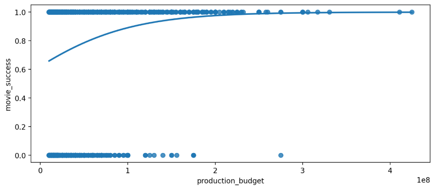
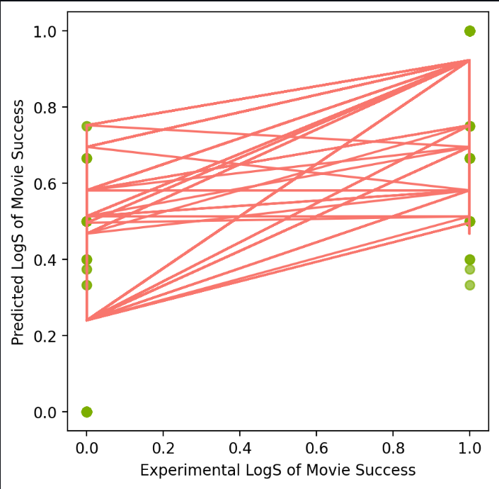

# Introduction

This chapter aims to describe the motivation, the current state of research, the overall goals, and the ethical implications that arose while preparing this project.

## Motivation

Over the past decade, there has been significant growth in the number of movies being produced, specifically with the rise of movie production within streaming platforms. With this leap in movie production also comes a drastic change in the overall determinants of movie success, as the preferences for movies are ever changing to fit the demand of consumers. Movie success for the purposes of this research is the likelihood that a movie will generate revenue, given certain factors of the movie as well as the production budget of the movie. Through the preliminary analysis of recent literature about determinants of movie production, it can be inferred that past research has not focused on the overall features of movies that can influence their success. Most of the analysis focuses on predetermined factors of movie success, such as whether an actors/actresses star power can influence the profitability of a movie. In order to provide an in-depth research of what exactly will determine the success of a movie, this research performs the following steps to determine the factors of movie success: take all current and known features of movie success into account, determine which features are positively correlated to movie success through a preliminary logistic regression, and then use the determined features to perform machine learning using different algorithms. Once the machine learning model is properly trained with the given data, the end product is an interactive Streamlit-hosted application where a user is able to be given movie recommendations based on the correlation between the movie that the user chose.

As the act of watching movies has been converted into a more lax and cost-effective activity thanks to the rise of streaming platforms, then it can be inferred that movies are an integral part of the way that people spend their leisure time. Therefore, continuing on from past research is necessary in order to propel the movie industry to be more in line with the rise in interest for personalized recommendation systems. The overall motivation for this area of research lies within the lack of reputable studies on how movie recommendation systems can influence the overall success of a movie. In order to provide insight into how the research gap in movie recommendation systems influences movie success, this paper does the following:

1. Use a machine learning model to predict the overall success of a movie and
2. Use the given results to provide users with a list of movie recommendations based on the preference a user has on the given movie factors

## Current State of the Art

This section of the research paper is an in-depth analysis of the key points of movie research, what knowledge gap is left from prior research, the way that this research provides further insight, and any challenges that have been made to this research/prior research.

### Past Areas of Research and Knowledge Gap

Notable areas of research that the movie industry focuses on is the prediction of movie success. For instance, experiments conducted by other data scientists featured a tool that would be able to predict movie success, with [@movie_success_1]'s tool ultimately being used to "predict the gross box office revenue to the nearest ten’s of million" and to "predict if the movie would make money, not by a specific amount, just if the budget was smaller than the revenue from ticket sales". [@movie_success_1]’s tool is then used to evaluate the specific percentage of the accuracy of their machine learning model when compared with their data on successful movies. When comparing the results of different experiments, the accuracy of the machine learning model hovered at around 60-64.7% range for accuracy of their models, and oftentimes are building off of previous research's machine learning models. As most of the previous experiments conducted in this area are built off of previous research and contain only data-fueled results (as in there is nothing interactive for users to do with the results), then it is essential for further research to be done in order to further understand what affects the overall success of a movie.

With this, the proposed area of research focuses on essentially the same methodology, where the machine learning model is used as a predicator of movie success. As previously stated, the knowledge gap for this area of research is by extending previous research to include an interactive application, where users can utilize the pre-computed results from this research to display the list of recommended movies. This widens the chosen audience for the results of this paper to include all public users, movie industry personnel, and other data researchers. This ensures that the increasing demand for personalized movie recommendations is taken into account within this area of research.

### Proposed Solution to Knowledge Gap

In order to gather relevant movie data for analysis, the following sources were used: The Numbers API: Opus, OMDB API, Kaggle, and IMDB. These websites/API's are a host for multiple datasets used for predictive analysis and have been highly regarded among other data scientists. The different datasets used are described in the following tables:


Table: Extract of The Numbers: Opus Dataset

| title                    | rating    | ...  | sequel | movie_success |
|:--------------------------|:-----------|:---|:--------|:---------------|
| Madea's Family Reunion   | PG-13     | ...  | 1      | 1             |
| Krrish                   | Not Rated | ...  | 1      | 1             |
| End of the Spear         | PG-13     | ...  | 0      | 1             |
| A Prairie Home Companion | PG-13     | ...  | 0      | 1             |
| Saw III                  | R         | ...  | 1      | 1             |
| Employee of the Month    | PG-13     | ...  | 0      | 1             |
| Edmond                   | R         | ...  | 0      | 0             |
| Peaceful Warrior         | PG-13     | ...  | 0      | 0             |
| Turistas                 | R         | ...  | 0      | 1             |
| Kabhi Alvida Naa Kehna   | Not Rated | ...  | 0      | 1             |
| Jackass: Number Two      | R         | ...  | 1      | 1             |
| Copying Beethoven        | PG-13     | ...  | 0      | 0             |
| For Your Consideration   | PG-13     | ...  | 0      | 0             |
| Crank                    | R         | ...  | 0      | 1             |
| Fateless                 | R         | ...  | 0      | 0             |
| Running With Scissors    | R         | ...  | 0      | 0             |
| Step Up                  | PG-13     | ...  | 0      | 1             |
| Find Me Guilty           | R         | ...  | 0      | 0             |
| Infamous                 | R         | ...  | 0      | 0             |
| Letters from Iwo Jima    | R         | ...  | 0      | 1             |


Table: Extract of the Netflix Dataset from Kaggle

| type    | title                                               | director                                          | ...  | rating |
|:---------|:-----------------------------------------------------|:---------------------------------------------------|:---|:--------|
| Movie   | Dick Johnson Is Dead                                | Kirsten Johnson                                   | ...  | PG-13  |
| TV Show | Blood & Water                                       |                                                   | ...  | TV-MA  |
| TV Show | Ganglands                                           | Julien Leclercq                                   | ...  | TV-MA  |
| TV Show | Jailbirds New Orleans                               |                                                   | ...  | TV-MA  |
| TV Show | Kota Factory                                        |                                                   | ...  | TV-MA  |
| TV Show | Midnight Mass                                       | Mike Flanagan                                     | ...  | TV-MA  |
| Movie   | My Little Pony: A New Generation                    | Robert Cullen, José Luis Ucha                    | ...  | PG     |
| Movie   | Sankofa                                             | Haile Gerima                                      | ...  | TV-MA  |
| TV Show | The Great British Baking Show                       | Andy Devonshire                                   | ...  | TV-14  |
| Movie   | The Starling                                        | Theodore Melfi                                    | ...  | PG-13  |
| TV Show | Vendetta: Truth, Lies and The Mafia                 |                                                   | ...  | TV-MA  |
| TV Show | Bangkok Breaking                                    | Kongkiat Komesiri                                 | ...  | TV-MA  |
| Movie   | Je Suis Karl                                        | Christian Schwochow                               | ...  | TV-MA  |
| Movie   | Confessions of an Invisible Girl                    | Bruno Garotti                                     | ...  | TV-PG  |
| TV Show | Crime Stories: India Detectives                     |                                                   | ...  | TV-MA  |
| TV Show | Dear White People                                   |                                                   | ...  | TV-MA  |
| Movie   | Europe's Most Dangerous Man: Otto Skorzeny in Spain | Pedro de Echave García, Pablo   Azorín Williams | ...  | TV-MA  |
| TV Show | Falsa identidad                                     |                                                   | ...  | TV-MA  |
| Movie   | Intrusion                                           | Adam Salky                                        | ...  | TV-14  |


Table: Extract of the Hulu Data from Kaggle

| type    | title                                                        | director | ...  | rating |
|---------|--------------------------------------------------------------|----------|---|--------|
| Movie   | Ricky Velez: Here's Everything                               |          | ...  | TV-MA  |
| Movie   | Silent Night                                                 |          | ...  |        |
| Movie   | The Marksman                                                 |          | ...  | PG-13  |
| Movie   | Gaia                                                         |          | ...  | R      |
| Movie   | Settlers                                                     |          | ...  |        |
| TV Show | The Halloween Candy Magic Pet                                |          | ...  |        |
| Movie   | The Evil Next Door                                           |          | ...  |        |
| TV Show | The Next Thing You Eat                                       |          | ...  |        |
| TV Show | Queens                                                       |          | ...  | TV-14  |
| TV Show | The Bachelorette                                             |          | ...  | TV-14  |
| TV Show | The Real Queens of Hip-Hop: The   Women Who Changed the Game |          | ...  |        |
| Movie   | Dream Horse                                                  |          | ...  | PG     |
| Movie   | Out of the Shadows: The Man Behind   the Steele Dossier      |          | ...  |        |
| TV Show | Wakefield                                                    |          | ...  |        |
| TV Show | Home Sweet Home                                              |          | ...  | TV-PG  |
| Movie   | Showtime Championship Boxing: Lopez   vs. Salido (R)         |          | ...  |        |
| TV Show | Showtime Championship Boxing: Wilder   vs. Molina            |          | ...  | TV-14  |
| TV Show | America's Book of Secrets                                    |          | ...  | TV-14  |
| TV Show | Beyond Oak Island                                            |          | ...  | TV-PG  |


Table: Extract of Prime Data from Kaggle

| type    | title                             | director                    | ...  | rating |
|---------|-----------------------------------|-----------------------------|---|--------|
| Movie   | The Grand Seduction               | Don McKellar                | ...  |        |
| Movie   | Take Care Good Night              | Girish Joshi                | ...  | 13+    |
| Movie   | Secrets of Deception              | Josh Webber                 | ...  |        |
| Movie   | Pink: Staying True                | Sonia Anderson              | ...  |        |
| Movie   | Monster Maker                     | Giles Foster                | ...  |        |
| Movie   | Living With Dinosaurs             | Paul Weiland                | ...  |        |
| Movie   | Hired Gun                         | Fran Strine                 | ...  |        |
| Movie   | Grease Live!                      | Thomas Kail, Alex Rudzinski | ...  |        |
| Movie   | Global Meltdown                   | Daniel Gilboy               | ...  |        |
| Movie   | David's Mother                    | Robert Allan Ackerman       | ...  |        |
| Movie   | Forest Fairies                    | Justin G. Dyck              | ...  |        |
| Movie   | Take Care                         | Liz Tuccillo                | ...  |        |
| Movie   | The Night Eats The World          | Dominique Rocher            | ...  |        |
| Movie   | Resilencia                        | Jep Barcelona               | ...  |        |
| Movie   | Elon Musk: The Real Life Iron Man | Sonia Anderson              | ...  |        |
| Movie   | Summer '03                        | Becca Gleason               | ...  |        |
| Movie   | Zoombies                          | Glenn Miller                | ...  | 13+    |
| TV Show | Zoo Babies                        |                             | ...  | ALL    |
| TV Show | Zoë Coombs Marr: Bossy Bottom  |                             | ...  | 18+    |


Table: Extract of Disney+ Data from Kaggle

| type    | title                                            | director                          | ...  | rating |
|---------|--------------------------------------------------|-----------------------------------|---|--------|
| Movie   | Duck the Halls: A Mickey Mouse Christmas Special | Alonso Ramirez Ramos, Dave Wasson | ...  | TV-G   |
| Movie   | Ernest Saves Christmas                           | John Cherry                       | ...  | PG     |
| Movie   | Ice Age: A Mammoth Christmas                     | Karen Disher                      | ...  | TV-G   |
| Movie   | The Queen Family Singalong                       | Hamish Hamilton                   | ...  | TV-PG  |
| TV Show | The Beatles: Get Back                            |                                   | ...  |        |
| Movie   | Becoming Cousteau                                | Liz Garbus                        | ...  | PG-13  |
| TV Show | Hawkeye                                          |                                   | ...  | TV-14  |
| TV Show | Port Protection Alaska                           |                                   | ...  | TV-14  |
| TV Show | Secrets of the Zoo: Tampa                        |                                   | ...  | TV-PG  |
| Movie   | A Muppets Christmas: Letters To Santa            | Kirk R. Thatcher                  | ...  | G      |
| Movie   | Adventure Thru the Walt Disney Archives          | John Gleim                        | ...  | TV-PG  |
| Movie   | Puppy for Hanukkah                               |                                   | ...  | TV-G   |
| Movie   | The Pixar Story                                  | Leslie Iwerks                     | ...  | G      |
| TV Show | Dr. Oakley, Yukon Vet                            |                                   | ...  | TV-PG  |
| Movie   | America the Beautiful                            |                                   | ...  | TV-PG  |
| Movie   | Baymax!                                          |                                   | ...  | TV-G   |
| Movie   | Ciao Alberto                                     | McKenna Harris                    | ...  | TV-PG  |
| TV Show | Disney Fancy Nancy                               |                                   | ...  | TV-PG  |
| TV Show | Disney Intertwined                               |                                   | ...  | TV-PG  |


Table: Extract of IMDB Dataset from IMDB

| tconst    | primaryTitle                                | isAdult | ...  | genres                   |
|-----------|---------------------------------------------|---------|---|--------------------------|
| tt0000001 | Carmencita                                  | 0       | ...  | Documentary,Short        |
| tt0000002 | Le clown et ses chiens                      | 0       | ...  | Animation,Short          |
| tt0000003 | Pauvre Pierrot                              | 0       | ...  | Animation,Comedy,Romance |
| tt0000004 | Un bon bock                                 | 0       | ...  | Animation,Short          |
| tt0000005 | Blacksmith Scene                            | 0       | ...  | Comedy,Short             |
| tt0000006 | Chinese Opium Den                           | 0       | ...  | Short                    |
| tt0000007 | Corbett and Courtney Before the Kinetograph | 0       | ...  | Short,Sport              |
| tt0000008 | Edison Kinetoscopic Record of a Sneeze      | 0       | ...  | Documentary,Short        |
| tt0000009 | Miss Jerry                                  | 0       | ...  | Romance                  |
| tt0000010 | Leaving the Factory                         | 0       | ...  | Documentary,Short        |
| tt0000011 | Akrobatisches Potpourri                     | 0       | ...  | Documentary,Short        |
| tt0000012 | The Arrival of a Train                      | 0       | ...  | Documentary,Short        |
| tt0000013 | The Photographical Congress Arrives in Lyon | 0       | ...  | Documentary,Short        |
| tt0000014 | The Waterer Watered                         | 0       | ...  | Comedy,Short             |
| tt0000015 | Autour d'une cabine                         | 0       | ...  | Animation,Short          |
| tt0000016 | Boat Leaving the Port                       | 0       | ...  | Documentary,Short        |
| tt0000017 | Italienischer Bauerntanz                    | 0       | ...  | Documentary,Short        |
| tt0000018 | Das boxende Känguruh                        | 0       | ...  | Short                    |
| tt0000019 | The Clown Barber                            | 0       | ...  | Comedy,Short             |

---


As a way to deliver a movie recommendation system, this research extends previous research by linking the results of the machine learning model to a Streamlit application programming interface (API), which provides two unique experiences for the users. 

The first section of the application is centered toward movie enthusiasts, where it has four features that can be used. The first feature is a movie search webpage, where a user can search for the statistics of a movie by the title. The second feature is an interactive movie prediction webpage,  where users can plug in the different factors of a movie, the machine learning model runs the different algorithms, and then the users can see the predicted success of the movie, along with the accuracy of the prediction. This is meant to give insight to the users on the overall process of the tool, as well as give them a fun way to play around with data. The third feature is the movie recommendation webpage, where the user can input a movie title and be given a list of recommendations based on different features associated with the title of the movie (plot, directors, actors/actresses, and genre). Users can choose to be given movie recommendations based on one of the features or all of the features. The fourth feature is another interactive predictor of movie success, where users can type in different titles, directors, actors, MPAA ratings, genre, and plot into the given prompt. The result is a prediction from the machine learning model of whether their given input of one of the features leads to a successful movie.

The second section of the Streamlit API contains a web page of the different sections of the research results, as well as an interactive way for users to look at the information for the different features being analyzed. The first web page features a way for users to run a simple linear analysis of a dataset, with some corresponding graphs being produced as well. This was created to show the users a visual representation of how the different features can affect movie success and the movie production budget. The second web page shows the ETL (extracting, transforming, and loading) steps performed to the raw data in order to have a workable, clean version of the data for analysis. The cleaned data is also available as a downloadable CSV file for the user as well. The third web page extends the previous analysis web page by allowing users to upload their own datasets for analysis. This allows users to see visualizations about the number of null values in their dataset, descriptive analysis of the features of their dataset, box plots, and more visualizations of the data. The fourth web page shows an interactive analysis of the regressions run on the research data, as well as different visualizations provided from the regression. The final webpage offered on this Streamlit API is the machine learning segment, where the user can run different machine learning algorithms against the movie data. The result is different visualizations of the accuracy of the model, as well as the overall accuracy that the model provides with the given data. There are currently 6 different machine learning algorithms that are available to the users for testing, with 3 being focused on linear-based algorithms and the last 3 being focused on logistic-based algorithms.

### Challenges to Proposed Research

Some of the challenges associated with this area of research deals with the amount of data that is being analyzed, as well as the overall accuracy of the machine learning model being used. Given the accuracy of the machine learning models in previous research, then the model being used for this research introduces some variability to the results. Additionally, the number of data points being analyzed can also influence the variability of the results, as this research runs the risk of giving results on antiquated and/or biased data. For example, a movie that is proven successful in 2008 may not contain all of the features of a successful movie in 2023 given the changes in consumerism in the movie industry. As a way to combat this loss of usefulness of the model/data, this research is using continuously updated data and data collection. For example, the data being used from IMDB is updated daily and the data from Kaggle is updated monthly. However, this runs the risk of the model becoming too slow to function, as it has to process and go through more movies in order to get it's results. Therefore, the datasets are stored in Streamlit's cache decorator instead of the computer's memory, so that the cached results and pathways can be reset with each refresh of the dataset. This way, the model stays as relevant as possible and is not too slow once more users are able to use the API.

## Goals of the Project

As most of the project is dedicated towards predicting movie success and providing a more unique movie experience, then the main goal is to create a simplified application that users can navigate to for either result that they desire. Therefore, the creation of an application was required, which is where Streamlit comes into play. Streamlit is an open-source Python library where data scientists can create custom web apps for machine learning and data science. Using Streamlit to build the interface for the users streamlines the process of deploying the application, which allows for a faster runtime and less bugs during future uses of the application.

Additionally, this research aims to improve the accuracy rate of the machine learning model beyond previous research, where research has hovered at around 64.7% for the accuracy of the model. As most of the other research has analyzed a small sample of movie data, this project aims for a better accuracy rate by continuously evaluating a bigger sample size. The chosen sample size is set at 20,000-30,000 movies, which allows for a more accurate model prediction, as previous research had hovered at around 100-200 movies. Since previous research used dataset from certain time periods and not continuously updated datasets (such as the IMDB, Netflix, Hulu, Disney+, and Amazon Prime datasets, which are updated either daily or monthly), then their accuracy rate would only refer to the accuracy of their model for *the chosen time period*. This limits the scope of their results to a certain timeframe of the movie industry, instead of allowing for variation of the features that make a movie successful.

## Ethical Implications

### Information Privacy

In regard to information privacy, two out of the three different subgroups have anonymity in their contributions. The different subgroups are categorized as the following: the sales subgroup (people who contributed to the box office sales/leave reviews that indirectly influence others to contribute to the sales), the rating subgroup (the people that make up the recommended rating for movies), and the production subgroup (the people that directly contribute to the production of the movie). For the sales and rating subgroups, they are least affected by the collection of movie data, as their data was obtained anonymously and does not contain references to their personal identity. Therefore, this section of ethical implications does not necessarily pertain to them. For the production subgroup, since their identity is taken into consideration when analyzing the movie data, then they could face repurcussions on the information that is generated by the results of this research. In order to ensure that there is not an ethical violation for this project, there is a disclaimer that displays before using the analysis tool. This disclaimer reinforces the notion that this project does not have any relation to the subjects being analyzed and should not be used as a sure way to judge the production/people present in the movie data. With this disclaimer, the hope is to clear any ethical violations that may arise from the analysis of the data.

### Information Accuracy

For information accuracy, two out of the three subgroups are ethically affected and should be acknowledged. The sales subgroup is affected, as the reviews that are left for movies may contain bias or a preference for certain actors or directors. As it has been proven in past research that the celebrity status of actors directly contribute to the success of movies, then it can be inferred that movies with a high celebrity presence may also garner more positive reviews, regardless of the actual production level of the movie. This can create inaccurate reviews, which can skew the data being used for this project. The rating subgroup is affected, as there are differing opinions on the certain age group that can be classified towards different movie ratings. Depending on what country and on what source, the age grouping for PG or G movies, for example, can be different. The production subgroup is not necessarily impacted by information accuracy, as their data can be verified by multiple sources, as well as the movie itself. To address the aforementioned information accuracy concerns, I primarily used data and sources that have been peer-reviewed and/or are reputable among the movie industry. For example, IMDB is a site that hosts large information on movies and is one of the more accurate sources for movie data. By using data collected from this site, the research can stay clear of using inaccurate information, thereby reducing the ethical complications that may arise.

### Potential Misuse

For the potential misuse of my results, such as the unintended consequences mentioned in the information privacy section, two out of the three subgroups are affected. For the sales subgroup, as their contributions to the revenue of a movie and/or the reviews of a movie are to be explored and analyzed with the tool, then their data could be misused if it is not analyzed accurately. With the production subgroup, as their identify is used to classify certain aspects of the data (especially for actors and directors), then there may be a misuse of the results obtained from the tool. For example, any negative correlations that are found between movie success and a certain actress or director could unintentionally create backlash for them. This could lead to detrimental consequences for the certain actress or director, which would put their use of data in jeaporady ethics-wise. For the rating subgroup, since their data is more or less widely-known and accepted, then there is a very slim chance that their data can be misused. In order to ensure that the data that has been collected does not get misused or misinterpreted, any negative links to the success of movies that are found will not be published. As this is outside of the scope of the chosen area of research, this information is irrelevant to the basis of the predicition model. Additionally, this issue will be referenced in the aforementioned disclaimer, as it is imperitive that any potential misrepresentation of the results are addressed before the use of the prediction tool.

### Data Bias

One of the main ethical complications that arose during the course of this research were the question of whether there was a bias in the data collection process. In regard to the question of data bias, all three subgroups are directly affected. As every dataset is determined to always have some sort of bias, whether that is through the collection or the distribution of the data, then this was the case of determining which dataset contained the *least* amount of bias. This is important to the three subgroups, as all of their information are used to during the analysis of the movie data. Therefore, any skewed results as a result of data bias would indirectly reflect badly on the people mentioned in the data, and not on the source of the data itself. To combat this, this research only occupies movie data that is obtained from reputable sources and/or third-party data collection sources. This is evident in the way that the chosen movie data was obtained, where the Opus Data data collection company provided this research with datasets about the movie production sales and personnel. Opus Data, a database management system, is the host for the datasets collected by the website *The Numbers*, "a free resource for industry professionals, the investment community, and movie fans to track business information on movies", with their site being "the largest freely-available database of movie business information on the web" [@the_numbers]. Kaggle, a subsidiary of Google LLC, provided the streaming data for Netflix, Hulu, Disney+, and Amazon Prime by web scraping the information directly from their respective websites. Since Kaggle is a platform for the community of data scientists to share and view different data, then this source has the advantage of being constantly peer-reviewed through the use of upvotes and downvotes. The chosen datasets are the more 'popular' data available and contained a large ratio of upvotes to downvotes, as well as numerous shares and downloads. Statista, "a leading provider of market and consumer data" was used to get information on the demographics of users that contributed to the movie sales/revenue. This is one of the more reliable statistics website, as "over 1,100 visionaries, experts and doers continuously reinvent Statista, thereby constantly developing successful new products and business models" [@statista]. As all of these sources are constantly updated, heavily peer-reviewed, and contain a low risk of data bias, then they would mitigate any ethical complications that would arise from data bias.

# Related work

This section explores the literature behind what components of the movie industry influence the revenue that movies generate at the box office and on streaming platforms. More specifically, whether actors, reviews, production budget, and the digitization of movies affects the overall success of a movie. With the rise of streaming platforms and the production of multi-celebrity featured appearances in film, this type of analysis is an important area of study towards the economics of the movie industry. This analysis also helps to determine what data proponents are focused on during the methodology section of this paper.

### The Power of Stars: Do Star Actors Drive the Success of Movies?

In [@elberse]'s paper, they research the question of whether the involvement of stars is critical to the success of motion pictures. That notion appears to be the driving force behind movie studios, which frequently award performers multimillion dollar salaries. Using an event analysis that examines the effects of more than 1200 casting announcements on trading behavior in a simulated and actual stock market environment comprised of actors/actresses, this research provides insight into the returns on this investment [@elberse]. The author reinforces the concept that the presence of stars influences the earnings of films outside of the theater and also offers insight into the size of this effect. Stars, for the purposes of this paper, is defined as an individual who has a proven trackhood of participation in movies with an abnormally large amount of revenue. For instance, according to the projections, stars generate $3 million in theatrical income on average. The author additionally looks at the factors that affect the magnitude of stars in a cross-sectional examination of the group dynamics literature. The author demonstrates that with a stronger cast, among other factors, a newly hired celebrity with either a history of box office triumphs or a good creative reputation has a greater impact. Finally the author does not discover that the production value of movie firms that release the movies increases when stars are involved, therefore there is insufficient evidence to draw the conclusion that stars add more value than they capture. The author addresses the movie industry's managers' ramifications.

In [@elberse]'s paper, the main data that is used in their research comes from the HSX. The HSX, an online market simulation that focuses on the film business, is the main source of data. It had about 500,000 registered users ("traders") as of January 2005, a frequent trader group of over 80,000 accounts, and about 19,500 daily unique log-ins. By strategically exchanging MovieStocks and StarBonds, among other things, new users can boost the value of their portfolio after receiving 2 million "Hollywood dollars" (abbreviated as "H$2 million"). Although the trading community is fairly diverse, the most active traders are typically avid users and early adopters of entertainment products, particularly for movies. All casting announcements that appeared in the HSX Market Recap report between November 2001 and January 2005 make up the sampling frame for this study. Five notifications that mentioned the same Movie- Stock and appeared within two weeks of one another were disregarded in order to avoid difficulties with the event study methodology, leaving a total of 1258 announcements. Together, they cover 602 stars from 496 films. [@elberse] considered each of the actors and actresses listed on the StarBond market to be a "star" for the purposes of this study, as they stand out from the multitudes of dreamers without a profession in film thanks to their presence on the StarBond market.

Previous literature about the economic impact of star power on movie revenue has been mixed, to say the least. Some research Ravid 1999 has not shown a correlation between earnings and talent involvement [@austin1989] [@devany_walls] [@litman] [@litman_ahn] [@ravid]. Others have found strong evidence that a film's likely cumulative, weekly, or opening-week sales rise with the rank of the star talent connected with it [@elberse]. In their study of Wall Street equity research analysts, Groysberg, Polzer, and Elfenbein concluded that the movie industry benefits from having people who perform well on an individualized basis [@groysberg_elfenbein]. They point out that while stars can contribute directly to the team's performance, they can also have an indirect impact on success, such as raising the group's perception among outsiders. The latter finding is suitable in the context of movies. The two reputations that, in general, can be the source of a star's power are their: economic reputation, which is generated from their box office success, and their artistic reputation, which is obtained from the acclaim of critics or peers [@delmstri]. Ravid's measures are directly related to these two reputations. Some studies have demonstrated that a star's past box office performance is a good predictor of his or her potential in the future and is a valuable resource for studio executives [@lampel_shamsie] [@litman_kohl] [@ravid] [@sochay] [@chisholm]. [@elberse] adds to these mixed reviews by testing both of the different dimensions to a star in their hypothesis (H1): The impact of a star on a film's box office revenues positively depends on (a) the star's economic reputation, reflected by his or her historical box office performance, and (b) the star's artistic reputation [@elberse].

One of the ways that the author used to describe the variables is through the event study methodology. In several areas of business research, event studies are a common methodology [@campbell]. Event studies have been employed in marketing to comprehend the effects of, among other things, company name changes [@horsky], new product introductions [@chaney], brand extensions [@lane], celebrity endorsements [@agrawal], and the addition of online channels [@geyskens] on firm valuation. In this case, an event study approach has benefits over the field's previous research. The event research methodology, first and foremost, enables a comparison of a movie's anticipated performance prior to and following the casting announcement [@elberse]. Second, the event research approach makes it possible to examine the influence of a certain actor or actress when announcements only involve one famous person. Additionally, these findings are consistent with the 0-rings theory, which asserts that in order to produce a work of unified excellence, every input must perform at least to a certain degree of dedication and expertise [@elberse]. This idea reflects a fundamental characteristic of multiplicative production processes, namely that the quality of an output depends on all inputs meeting a certain standard [@caves] [@kremer].

The variables used for this study are: star economic history, star artistic history, cast count, cast economic history, and cast artistic history. Star economic history is measuring the ‘average box office revenues for the star’s five latest movies at the time of the announcement’ [@elberse]. Cast count measures the number of other cast members at the time of a star’s announcement, as this has been studied extensively showing an effect on the movie’s overall revenue success – such as Natalie Portman’s joining the cast of Cold Mountain. Star artistic history measures the ‘total number of Oscars and Golden Globes and nominations for the star in the five years before the announcement’ – ergo, whether they are considered a breakout star or have acclaimed recognition for their talent prior to the emergence of the movie [@elberse]. Cast economic history measures the average of each cast member’s box office revenues for their last five movies at the time of their announcement; whether the stars have a demonstrated track record of fostering more movie sales in prior work [@elberse]. The cast artistic history measures the average number of Oscars/Golden Globs/nominations for the cast members in the five year prior to the movie announcement; whether there is an established strong cast prior to the joining of the actor/actress to the movie.

The results of this study can tell us a lot about the research question of the paper. The author used an event research approach to tackle this problem and examined the effects of more than 1200 casting announcements on both simulated and actual stock market trading. Strong evidence was found by the author to support the idea that star involvement does, in fact, increase movie sales; more specifically, the findings imply that stars may be "worth" several million dollars in revenue. The stars' prior performances in an artistic and financial sense (expressed as box office success and awards or nominations collected, respectively), as well as the quantity and prior performances of other star cast members, were also found to be significant determinants of the magnitude of that effect [@elberse]. The author was unable to discover evidence to support the claim that celebrities also affect the value of movie studios or the media conglomerates to which they belong, despite the fact that stars appear to have an impact on film-level profits.

The conclusion reached by this paper is that the participation of stars in movies positively affects the revenue generated by the box office, which is in line with previous research and conventional wisdom. This study is an initial dive into the realm of research in star power and the effect that it has on the movie industry, yet they were unable to support a significant relationship between stars and movie revenue due to the lack of ‘real’ evidence. Nevertheless, this study’s insights could help movie industry professionals reconsider their talent acquisition process, especially as it relates to the revenue that they hope to generate for their movie. One way that they could reconsider the talent search process is to not place so much emphasis on obtaining an A-list star, as the results of this study show that they have a barely distinguishable positive influence on movie revenue unless there is an independently strong cast present. Therefore, it could be in the best interest to focus on building a strong cast of talented individuals prior to searching for an A-lister to heighten their movie sales.

Some of the potential shortcomings of this paper are that the analysis is done on data that is not ‘real’. Ergo, where the data was collected off of projected movie sales, stars, budgets, and revenues from the HSX stratosphere. This could cause some of the results to be skewed when compared with real-world actual projections. Additionally, there is not an analysis done on the impact that stars have on movie revenues using movie-level profit data. This study does provide a good basis for the research into star power and movie revenue, but it also does not provide a reasoning for why some stars are simply bigger than others. Whether that is because they have superior acting skills, perceived better marketing strategies, or through other endorsements/commitments. This could potentially be addressed in future research.

### The Economics of Movies (revisited): A Survey of Recent Literature

As of the publishing of [@mckenzie] article, only a few academic studies on the economics of the film industry had been published twenty years prior. This drastically altered during the first ten years of the new century, and numerous research started to appear in journals for both related disciplines and the study of economics. This tendency has persisted over the succeeding and most recent ten years, and the literature on the "economics of movies" has fully developed during this time. While disciplines like economics and marketing continue to do the most work, more recent data-oriented disciplines are increasingly focusing on the market and its wealth of rich and easily accessible data. This study aims to provide a succinct but thorough evaluation of contemporary literature on this endlessly fascinating sector of the movie industry. Though this paper does not contain new research, it combines all relevant new research into a comprehensive review.

The previous literature that this work references had studies on movie microeconomics (demand and supply sides), movie macroeconomics (for where the entire industry is considered), and other work related to the movie industry (such as TV, video-on-demand industries, etc.). For demand, this included studies modeling box office outcomes, which are commonly referred to as ‘hedonic’ demand models as they seek to decompose the revenue of films into quantifiable characteristics [@mckenzie]. 

Research efforts have also been made to better understand the behavioral factors that produce heavy-tailed distributions that are related to blockbusters, which complements research-related heavy-tailed distributions. According to [@moretti], social learning shocks are more pronounced in movies aimed at teenagers, and he eliminates network externalities by utilizing data on weather shocks. [@gilchrist] contend, however, that demand momentum is not just influenced by social learning but also by preferences for shared experiences (i.e., network effect). Additionally, [@cabral] contend that network externalities, also known as social consumption value, play a significant effect. Regardless of the method, blockbusters have been progressively significant over the past century for the performance of the industry [@mckenzie_smirnov] [@pokorny].

Numerous approaches have been used to continue investigating the effects of professional critics' reviews [@carrillat]. For instance, research has examined how advertising influences or is affected by critical evaluations [@moon_bergey]. It has also been thought that the absence of reviews before a movie's release could establish the causal connection [@brown2012] [@brown2013]. Related research examines the extent to which racial bias may affect box office receipts as well as whether genres linked to literary content react more to critics' reviews [@koschat] [@fowder]. Others investigate if reviews have a greater influence during uncertain economic times [@dhar]. In addition to the effect on box office results, additional study [@chen] explores how the parent corporation of the studio is impacted by critic reviews and whether it has any influence on the reviews of related critics [@dellavigna].

Academic research on the economic impact of stars, celebrities, and other off-screen talent has produced conflicting results [@hoffman] [@nelson_g]. The range of ways that variables measuring these inputs have been operationalized is one obvious explanation. Other studies use prior performance in terms of box office results and/or accolades, while several research use industry sources (such as Hollywood Hot Lists or IMDb's StarMeter).

The substance of a movie can be inferred from its classification rating by looking at whether it has adult themes. In models where box office revenues (or another variable, such critic evaluations) are the dependent variable of interest, researchers frequently include this as a type of control variable. By analyzing how classification ratings are created and how they affect customer demand and/or industrial supply decisions, [@mckenzie] attempted to get a deeper knowledge of classification ratings. A number of works in this field expand on prior investigations that described the "R-rating conundrum." This explains why studios keep making R-rated movies, even though they have lower box office success.

Academic research almost certainly follows the given the seismic shift toward various streaming providers. Research on subjects like catalog content, bundling, desire to pay, and the connections with piracy are just the tip of the iceberg as of now. While some of these studies are in line with previous and current research on other formats (such as DVD and TV), other research is brand-new and particular to these emerging businesses.

The studies on movies that have been published in the top economics journals offer some insight into how academics with research interests in this area could choose to target the top journals in the discipline. More specifically, these publications tend to focus on broader economic phenomena rather than movies per se. In that regard, intriguing research inquiries must go beyond the boundaries of the film industry. Of course, good facts and solid empirical research are necessary in addition to having the proper question. Researchers using data from the film industry must continue to guarantee that their work aligns with the recent focus in society.


### Estimating the Costs of Standarization: Evidence from the Movie Industry

The transfer of an industry from its existing technology standard to a more efficient one under the influence of network effects is the subject of this article. Adoption could be ineffectively delayed if the new technology is incompatible with the existing infrastructure. The identification and measurement of network effects have been the main topics of earlier empirical research on technology adoption under network effects. [@rysman] explores the methods used to address this problem and discusses it in the specific context of network effects. [@park] study ACH adoption by banks; [@tucker] studies video-messaging adoption by a bank's employees; [@goolsbee] study adoption of home computers. Recent contributions use regional or individual-specific exogenous shifters of network size to identify direct network effects. 

This paper adds to the body of knowledge by examining innovation and technology adoption using dynamic games. The research first assesses how externalities and business heterogeneity affect the adoption of new technologies. Second, this article adds to the body of empirical research on the film industry [@caoui]. In order to assess how the diffusion path differs from the social optimum, the current research uses the changeover from film to digital as an example of a technology standard switch. By offering a case study of excessive inertia in technology adoption and by separating the sources of surplus loss, the current research adds to this body of literature.

[@caoui]'s paper makes use of four brand-new datasets: (1) a panel documenting theater adoption of digital projectors at the screen level as well as details on regional market conditions and theater characteristics; (2) a time series of digital projector prices; (3) a time series documenting the percentage of movies distributed in digital; and (4) estimates of the average distribution cost curves (printing, shipping, and storage costs per movie print) under the film and digital technologies [@caoui]. A panel describing theatrical digital adoptions makes up the bulk of the dataset. The European Cinema Yearbooks, which are published by Media Salles, and a private digital platform called Cinego's online database were the two sources used to compile this information. Both sources are open to the public and offer glimpses of the French digital exhibition market at various times between June 2005 and March 2013. Five dates from the Cinego database and thirteen dates total are taken from the Cinema Yearbooks. Every current theater's acquisition of digital projectors is known for each of the 18 observation dates. The panel began operating aperiodically in 2008 and ends before the diffusion is finished in 2014. To ensure relative periodicity in the sample, five periods are dropped (6 months). 

The primary adoption panel dataset is supplemented by two additional datasets. The first can be found at the French National Center for Cinematography (CNC hereafter). Between 2005 and 2015, the CNC dataset offers a wealth of data on the features of local movie theaters, the size of the local market, and the proportion of digitally available films. More specifically, this annual dataset includes: (1) lists of all theaters that are currently open; (2) information about each theater's number of screens, seats, address, theater chain or individual owner, and whether it is an art house; (3) market population (categorical) at the level of urban/rural unit (defined below); and (4) the proportion of films that have been released in digital format (distributed partially or entirely in digital). The second supplementary dataset, also acquired from the European Audiovisual Observatory, offers time-series data on the price of purchasing a digital projector. 18 In particular, the time-series for the hardware adoption cost is created by adding (2) ancillary charges to (1) the cost of a digital projector (net of VPF contributions). A survey of projector manufacturers served as the basis for the price time series for digital projectors. Due to nondisclosure agreements between theaters and manufacturers, the actual prices paid by certain cinemas are not known to the general public. The "list" price of digital projectors, often known as the MSRP (manufacturer's suggested retail price), is assumed to be represented by this time-series.
The four types used (movie theater, market demand, digital projector, and movie distribution) for the different variables can be described in the following ways. The type ‘movie theaters’ is assigned to the variables digital screens (number of screens digitized over time), screens (total number of screens), seats (seats per screen), art house (binary variable to check if it is an art house theater), chain (identifies if the movie theater is a chain), and competitors screens (number of screens from a rival in the local market) [@caoui]. The type ‘market demand’ is assigned to the variables region (identifier for the regions used in the study) and market size (identifier for the different markets in Paris being studied) [@caoui]. The type ‘digital projector’ covers the variable adoption costs, which is the cost of buying the bare-minimum digital projector. The type ‘movie distribution’ relates to the variable digital movies, which is the total share of movies that were released in a digital form instead of a film format.
The findings point to the potential benefit of regulatory intervention in network industries, particularly in terms of coordinating businesses' adoption of cutting-edge technology. Additionally, the best tool (between adoption subsidies and standard-setting committees) relies on the reason for the inefficiency as well as the market segment that has too much inertia. According to the data, the upstream distribution market has the most inertia in the case of digital cinema.

The current study can be expanded in a number of ways, one of which is significant. It might be possible to relax the presumption that the digital manufacturing industry is competitive ("non-sponsored" technology) [@caoui]. In digital manufacturing, oligopoly or a monopoly may assist match the best diffusion path with the market outcome.

The author calculates the benefits of theaters switching to digital displays using information on theater adoption decisions and the extensive cross-sectional variance in theater and market parameters. The estimated model is used to determine how much excess inertia there is in the switch to digital. The author simulates two counterfactuals: in the first, a planner maximizes aggregate theater profits while taking into account the reaction function of upstream distributors; in the second, the planner imposes coordination on upstream digital distribution while still maximizing aggregate theater profits [@caoui]. The counterfactuals demonstrate that market forces did not offer sufficient inducements for a successful transition from 35mm to digital. Compared to when there is coordination, industry profits are lower under the non-cooperative market outcome. Additionally, excess inertia in the upstream distribution market is responsible for two-thirds of the surplus loss, while adoption externalities in the downstream exhibition market are responsible for the remaining one-third.

# Method of approach

## Introduction

This section of the paper focuses on the method of approach towards solving for the research question posed, where movies are being evaluated to determine what features make them successful. In order to determine the specific features that effect movies, stepwise regressions were ran using different data analysis tools. Once these features were identified, the data was analyzed by running multiple linear regressions in order to identify patterns in the data within the chosen features. Following this analysis, the data ran through different predictive regression algorithms and saved into different machine learning models, which were sorted based on accuracy. These trained models were then used to implement a movie recommendation application that is based on the predictions generated by the machine learning model. For reference, all of the technical descriptions featured in this section can be further elaborated on by visiting the [GitHub repository](https://github.com/ReadyResearchers/Movies123forMe) for this application.

## Data Collection and Validation

As mentioned previously, the following sources were used for data collection and analysis: The Numbers API: Opus, OMDB API, Kaggle, and IMDB. The different data obtained from these sources are described below. 

The Numbers is a free website that offers its resources to industry professionals, the investment community, and movie fans. These resources consist of tracking business information on movies, where the information gathered on these movies comes from either other free movie information sites (such as IMDB) or from sources in the industry (movie studios) [@the_numbers]. Through these resources, The Numbers is able to continously update their movie data, as they receive their information/updates on a daily basis. The Numbers collaborates with Opus Data to provide a movie API, where users of this API can obtain updated movie data. In order to not go outside of the scope of this project, this research uses the educational data provided by the API, where this package contains relevelant movie information for 1,900 movies spanning from 2006 to 2018. The dataset contains information on movies for the following: movie name, production year, movie ID, production budget, domestic box office, international box office, rating, creative type, source, production method, genre, sequel, and running time.

As most of the information in this dataset is numerical, then it was decided that obtaining more textual data was necessary to improve the predictive nature of the proposed model. Therefore, Kaggle was used to obtain data on the following streaming services: Netflix, Hulu, Disney +, and Amazon Prime. Kaggle is a free website that offers over 50,000 public datasets and 400,000 public notebooks that are used to perform data analysis tasks and data science work [@kaggle]. The specific datasets that were used contained information directly from Netflix, Hulu, Disney +, and Amazon Prime through webscraping done by other Kaggle users. This involves automating a program to visit a website, locating information through the website's HTML tags, and saving the data in a dataset. The chosen Kaggle dataset for Netflix contained all of the movies and TV shows (over 8,000) that were available on Netflix as of October 18th, 2021, with new updates to the data occuring Quarterly. The chosen Kaggle dataset for Hulu contains all of the movies and TV shows available to users, with the data also being updated Quarterly. The chosen Kaggle dataset for Amazon Prime contains information on close to 10000 movies or TV shows available on their platform, with the data being updated Monthly. The chosen Kaggle dataset for Disney+ contains information on 1300 movies or TV shows, with the update to the data occuring quarterly. All of these datasets contain information on the following features of a movie: show ID, type, title, director, cast, country, date added, release year, rating, and duration, listed in (genre), and description.

In order to display relevant information about movies for the predictive recommendation application, then the OMDB API was used. OMDB API is a free web service that obtains movie information to be used for data analysis and visualization. All content and images saved on the API are contributed and mainted by the users [@api]. This API provides information on the following features of a movie: title, year, rated, release date, runtime, genre, director, writer, actors, plot, language, country, awards, poster (image), ratings, metascore, IMDB rating, IMDB ID, type, DVD sales, Box Office earnings, production, and website.

As part of the training of the machine learning model, new data has to be introduced to the model for predictive analysis. IMDB is considered the world's most popular and authoritative source for movies and TV shows, therefore their free public datasets were chosen for implementation [@imdb]. There are a variety of different datasets that are available from IMDB, this paper decided to focus on one particular dataset that contained preliminary information about movies, which is the Title Basics dataset. This dataset contains information on the following features of a movie: title type, primary title, original title, isAdult, start year, end year, runtime (in minutes), and genre. Since the OMDB API only needs the movie title to perform it's searching functions, then the primaryTitle column is the only variable used in this dataset for analysis.

As the dataset with the most amount of numerical information and reputable sources, the Opus dataset was used for statistical analysis. Before being able to analyze the features, however, the Opus data needed to be cleaned.  Data cleaning is the process of removing incorrect, corrupted, incorrectly formated, or incomplete dat from within a dataset. For data cleaning, the language Python and the Python packages Pandas was used. As it was imperitive to be able to control the number of rows being displayed in the datasets, different functions were created with a rows parameter so that the number of rows to be converted could be controlled. Using the pandas feature 'read_csv', the dataset was transformed into a pandas dataframe. As part of the data cleaning process, the textual data inside of the dataframe is then converted into all lowercase. This make it easier to process the data. In pandas, columns are either inferred from the schema of the dataset or implicitly defined -- for the purposes of this paper, the schema was implicitly defined and the column names were set as the first row of the dataset. 

```python
@st.cache_data
def load_data_opus(nrows):
    data = pd.read_csv('pages/movie_data/movie_data/movie_data.csv', 
    nrows=nrows)
    lowercase = lambda x: str(x).lower()
    # setting up pandas dataframe for all of the files
    data.rename(lowercase, axis='columns', inplace=True)
    return data
```

In order to ensure accurate analysis of the information provided, any null values (or rows that contained no information) were dropped from the dataframe. Additionally, for the Netflix, Hulu, Disney +, and Amazon Prime dataframes, the rows containing information for TV shows were dropped as well. This is because the analysis of TV shows is outside of the scope of this project. Once only relevant data remained in the dataframes, then the data was converted into their respective data types. For example, the release year column was converted into datetime format. This ensures that the pandas dataframe can be analyzed easier and more efficiently.

```python
# drop nan values
opus = opus.dropna()
prime = prime.dropna()
netflix = netflix.dropna()
disney = disney.dropna()
hulu = hulu.dropna()

# dropping tv show rows
netflix = netflix[netflix['type'].str.contains("TV Show") == False]
prime = prime[prime['type'].str.contains("TV Show") == False]
disney = disney[disney['type'].str.contains("TV Show") == False]
hulu = hulu[hulu['type'].str.contains("TV Show") == False]
```

When comparing the success of a movie between different movies of varying data, the following features were found to have a statistically significant influence on the success of a movie: Rating, Genre, Production Budget, Sequel, Domestic Box Office Earnings, and International Box Office Earnings. This information was obtained through the following platforms/languages: R Studio Cloud, R, and Python. Using R Studio Cloud, multiple linear regressions were ran on all of the features of a movie from the cleaned Opus dataframe. Any features that did not have a statistically significant R2 value and P-value were removed from the dataframe. These features were 'movie names, creative type, source, and production method'. 

```r
# simple regression on genre
simple_model <- lm(movie_success ~ production_year + 
production_budget + rating + sequel + genre_Adventure + 
genre_Action + genre_BlackComedy+ genre_Comedy + 
genre_Concert.Performance+ genre_Documentary + 
genre_Drama + genre_Horror + genre_Musical + 
genre_RomanticComedy + genre_Thriller.Suspense + 
genre_Western, opus)
summary(simple_model)
stargazer(simple_model, type="text")

opus %<>% mutate(revenuehat = fitted(simple_model),
                 uhat = residuals(simple_model))
opus %>%
  select(movie_success, revenuehat, uhat) %>%
  head(10)

opus %>%
  select(movie_success, revenuehat, uhat) %>%
  stargazer(type = "text")
```

As the textual data (such as the genre) was statistically significant to the success of a movie, then it was imperitive to convert it into a format that R would be able to analyze. Therefore, all remaining textual data (genre) was converted into dummy variables. Dummy variables are when the column is exploded based on the unique values and then assigned a value of either 1 or 0 depending on the presence of the variable in the specific row. For example, if a movie is categorized in the genre 'Horror', then the column 'genre_Horror' will contain a 1 and all other variations of the genre column will contain a 0. This creation of dummy variables was done with Pandas using their 'get_dummies()' function. For the other textual column, 'rating', the 'map()' function was used. The map function executes a specified function for each item that it iterates through -- this is used when one wants to apple a single transformation function to all elements of a function (such as a list or tuple). In this case, the map function was used to assign a number to the text data for analysis, which effectively converts all text in the rating column into a number. These numbers have no effect on the weight that a specific rating has on a movie's success, they are simply arbitrary numbers that are used for identification purposes when running analysis on the data.

```python
opus = pd.get_dummies(opus, columns=['genre'])
opus['rating'] = opus['rating'].map({'G':0, 'PG': 1, 'PG-13': 2, 
'R': 3, 'NC-17': 4, 'Not Rated': 5})
netflix['rating'] = netflix['rating'].map({'TV-Y': 0, 'TV-Y7': 1, 
'TV-Y7-FV': 2,'G': 3, 'TV-G': 4, 'PG': 5, 
'TV-PG': 6, 'PG-13': 7, 'TV-14': 8,
'R': 9, 'TV-MA': 10, 'NC-17': 11, 
'NR': 12, 'UR': 13})
prime['rating'] = prime['rating'].map({'TV-Y': 0, 'TV-Y7': 1, 
'TV-Y7-FV': 2,'G': 3, 'TV-G': 4, 'PG': 5, 
'TV-PG': 6, 'PG-13': 7, 'TV-14': 8,
'R': 9, 'TV-MA': 10, 'NC-17': 11, 
'NR': 12, 'UR': 13})
disney['rating'] = disney['rating'].map({'TV-Y': 0, 'TV-Y7': 1, 
'TV-Y7-FV': 2,'G': 3, 'TV-G': 4, 'PG': 5, 
'TV-PG': 6, 'PG-13': 7, 'TV-14': 8,
'R': 9, 'TV-MA': 10, 'NC-17': 11, 
'NR': 12, 'UR': 13})
```

As none of the dataframes explicitly had a column that designated whether a movie was successful or not, then it was necessary to create a new column in the dataframes with this information. Regarding the Opus dataframe, movie success was categorized as either True or False for the following condition: True if the domestic box office and international box office (revenue) is greater than the production budget, and False if the production budget is greater than the revenue generated. In order to convert this into a readable format for the program to recognize, all True/False statements were then converted into 1 (True) and 0 (False). As this dataframe contained mostly numerical information, then it was used as the basis for movie success, where trends found in this dataframe would be applied to the features in the Kaggle and OMDB datasets. 

Given this, the following data from Opus Data was used to create movie success columns in the OMDB dataset: the average revenue generated by a successful movie, which in this case was $55,507,312.60 (USD). Essentially, any Box Office earnings that were equal to or exceeded the average revenue was classified as a movie success (1); anything else was classified as not a movie success (0). 

```python
train_data = pd.read_csv('movie_clean.csv')
train_data['earnings'] = train_data["BoxOffice"].replace(np.nan,"0")
train_data['earnings'] = train_data['earnings'].str.replace(r'[^\w\s]+', '')
```

For the Netflix, Hulu, Disney +, and Amazon Prime datasets, any genres that contained more than 150 number of movies being produced were categorized as a movie success (1) and any other genre under 150 movies produced were categorized as not a movie success (0). The genres TV-MA, PG-13, TV-14, and R were the genres that produced 150 or more movies, so these are the genres that contain successful movies.

## Data Analysis

Since the main part of this paper revolves around the determinants of movie success, then the data analysis had to center around the binary variable 'movie_success'. This binary variable is analyzed using Binary Logistic Regression, where this models the relationship between a set of independent variables and a binary dependent variable, which is coded as a 1 (movie success) or 0 (not a movie success). This involves the regression model prediciting P(Y=1) as a function of X, where the analysis is the probability that the dependent variable 'movie_success' will take a value of 1 given the independent variables of X. The independent variables used in this regression are categorical and continuous. In order to run the regression on only the statistically significant values, a step-wise linear regression was ran using R Studio Cloud. In this regression, a new variable was created (called total revenue) that was the sum of the domestic box office earnings and the international box office earnings. Through running a simple regression, the following features were found to be statistically significant, as they had a p-value that was less than .05 (this means that there is a 95% confidence level that this feature explains the overall model): production year, production budget, domestic box office, international box office, rating, sequel, running time, genre_Adventure, genre_Action, genre_Black Comedy, genre_Comedy, genre_Concert/Performance, genre_Documentary, genre_Drama, genre_Horror, genre_Musical, genre_Romantic Comedy, genre_Thriller/Suspense, genre_Western. Below are examples of the logistic regressions ran for each of the features being analyzed against movie success.

{width="500" height="400" style="display: block; margin: 0 auto" }

{width="500" height="400" style="display: block; margin: 0 auto"}


{width="500" height="400" style="display: block; margin: 0 auto"}


Since the column of movie success was created using the domestic box office and international box office figures, then these variables were ultimately dropped from the rest of the processing. The following is a graph generated by R Studio Cloud when regressing the residuals of all of the variables against movie success:

{width="500" height="400" style="display: block; margin: 0 auto"}


After doing the preliminary data analysis to find the statistically significant features, it was then time to do the machine learning analysis of the data. Machine learning is the process of 'making systems that learn and improve by themselves, by being specifically programmed' [@banoula]. For machine learning all of the statistically significant features were put as the x value, with the y-value being the movie success column. The data was randomized to make sure that it is evenly distributed and that the ordering does not affect the learning process. From there, the data is split into training and testing data. The training data (which is 30% of the total data) is what the machine learning model learns from, where it takes in all of the features included in x and then attempt to guess the possibility of y based on these features. The testing data (which is 70% of the total data) is used to check the accuracy of the model after training.

```python
opus = clean_data.clean_data()[0]
opus_cols = ['production_budget', 'rating', 'sequel', 'genre_Action', 
'genre_Comedy', 'genre_Drama', 
'genre_Adventure', 'genre_Black Comedy', 'genre_Concert/Performance', 
'genre_Documentary', 'genre_Horror',
'genre_Musical', 'genre_Romantic Comedy', 'genre_Thriller/Suspense', 
'genre_Western']  
ox, oy = opus[opus_cols], opus['movie_success']
ox_train, ox_test, oy_train, oy_test = train_test_split(
    ox, oy, test_size=.7, random_state=42)
```

In order to determine the correct machine learning model, the following models were evaluated with the same training/testing data: Linear Regression, Random Forest Regressor, Extra Tree Regressor, Decision Tree Classifier, Support Vector Machine, and Logistic Regression.

```python
def lr():
    lr = LinearRegression()
    # model building
    lr_fit = lr.fit(ox_train, oy_train)
    scores_lr = lr.score(ox_test, oy_test)
    st.write("Accuracy: ", scores_lr)
    otrain_pred = lr.predict(ox_train)
    otest_pred = lr.predict(ox_test)
    plt.figure(figsize=(5,5))
    plt.scatter(x=oy_train, y=otrain_pred, c="#7CAE00", alpha=0.3)
    z = np.polyfit(oy_train, otrain_pred, 1)
    p = np.poly1d(z)
    plt.plot(oy_train,p(otrain_pred),"#F8766D")
    plt.ylabel('Predicted LogS of Movie Success')
    plt.xlabel('Experimental LogS of Movie Success')
    st.write("Visualizing the difference between the train" + 
    "and test data when prediciting 'movie_success'")
    st.pyplot(plt.plot())
```

## Technical Diagram

{width="500" height="400" style="display: block; margin: 0 auto"}


## Technical Overview

All of these models contain specific algorithsm that are found in the sci-kit learn package [@scikit-learn]. For each of the regression algorithms chosen, they are fitted against the Opus X training data and the Opus Y training data. Once these two were fitted, the accuracy was evaluated using scikit-learn's 'score' method against Opus X testing data and Opus y testing data. Then, the training data was used to predict the Y column using scikit-learn's 'predict' function. Their accuracy was plotted using [@seaborn]'s and [@matplotlib]'s plotting capabilities. The following graphs are the accuracy scores of the selected 6 regression algorithms:

{width="500" height="400" style="display: block; margin: 0 auto"}


{width="500" height="400" style="display: block; margin: 0 auto"}


{width="500" height="400" style="display: block; margin: 0 auto"}


{width="500" height="400" style="display: block; margin: 0 auto"}


{width="500" height="400" style="display: block; margin: 0 auto"}


{width="500" height="400" style="display: block; margin: 0 auto"}

As the data is split up according to 'movie success' or 'not a movie success', then the Logistic Regression machine learning model was chosen for evaluation. Choosing the correct model is extremely important, as it determines the output of the model as well as the overall accuracy. The Logistic Regression model contains the most accuracte algorithms and can classify binary data, as shown by the most accurate score. In order to use the models for predictive analysis, they were exported into '.sav' files using [@joblib]'s dump method. The files were then exported into another file and were loading into variables using [@joblib]'s load function. 

```python
def predict(data): # pylint: disable=W0621
    """Initial set up function to import the machine learning models."""
    logreg_filename = "logreg_model.sav"
    lr_filename = "lr_model.sav"
    rf_filename = "rf_model.sav"
    et_filename = "et_model.sav"
    dtc_filename = "dtc_model.sav"
    svm_filename = "svm_model.sav"
    logreg = joblib.load(logreg_filename)
    lr = joblib.load(lr_filename)
    rf = joblib.load(rf_filename)
    et = joblib.load(et_filename)
    dtc = joblib.load(dtc_filename)
    svm = joblib.load(svm_filename)
    return logreg.predict(data), lr.predict(data), 
    rf.predict(data), et.predict(data), dtc.predict(data), 
    svm.predict(data)
```

Since all of the features used to evaluate the model are needed to make a prediction, then a prediction form was created, using [@streamlit]. All of the choices were saved as inputs for machine learning model, with the determination of the Y value being returned by the model. In order to convert the model's output into a readable format by non-technical users, then 0's were quantified as 'NOT A SUCCESS' and 1's were quantified as 'A SUCCESS'. 

```python
df = np.array([[prod_budget, rating, sequel, genre_Action,
    genre_Comedy, genre_Drama, genre_Adventure,
    genre_BlackComedy, genre_Concert, genre_Documentary,
    genre_Horror, genre_Musical, genre_RomanticComedy,
    genre_Thriller, genre_Western]], dtype=int)

    result_logreg = predict(df)[0]
    result_lr = predict(df)[1]
    result_rf = predict(df)[2]
    result_et = predict(df)[3]
    result_dtc = predict(df)[4]
    result_svm = predict(df)[5]

    result_logreg = result_logreg.reshape(1, -1)
    result_lr = result_lr.reshape(1, -1)
    result_rf = result_rf.reshape(1, -1)
    result_et = result_et.reshape(1, -1)
    result_dtc = result_dtc.reshape(1, -1)
    result_svm = result_svm.reshape(1, -1)

    score_logreg = G_machine_learning.logreg()[1]
    score_lr = G_machine_learning.lr()[1]
    score_rf = G_machine_learning.rf()[1]
    score_et = G_machine_learning.et()[1]
    score_dtc = G_machine_learning.dtc()[1]
    score_svm = G_machine_learning.svm()[1]

    st.subheader("Movie Success Results:")
    for i in result_logreg:
        if i[0].round() == 0:
            st.write("The Logistic Regression Machine " +
            "Learning model predicted your movie " +
            "would NOT BE A SUCCESS with a " +
            f"{ (100 * score_logreg) }% confidence! :(")
        elif i[0].round() == 1:
            st.write(f"The Logistic Regression Machine " + 
            "Learning model predicted your movie " +
            "would BE A SUCCESS with a " +
            f"{ (100 * score_logreg) }% confidence! :)")
        else:
            st.write("Please try again later.")
```

A simulation of the movie success results form is found below: 

{width="500" height="400" style="display: block; margin: 0 auto"}

{width="500" height="400" style="display: block; margin: 0 auto"}

For the rest of the data obtained, as they were composed of mainly textual data, the process of evaluating them was different. All of the Netflix, Amazon Prime, Disney +, and Hulu data was merged into one dataset. An extract from the OMDP API-generated dataset:


Table: Extract of the Merged & Converted OMDB API Dataset

| Title                            | Rated     | imdbRating | ...  | success | earnings |
|----------------------------------|-----------|------------|---|---------------|----------|
| Dick Johnson Is Dead             | PG-13     | 7.4        | ...  | 0             | 0        |
| Dick Johnson Is Dead             | PG-13     | 7.4        | ...  | 0             | 0        |
| Dick Johnson Is Dead             | PG-13     | 7.4        | ...  | 0             | 0        |
| My Little Pony: A New Generation | PG        | 6.8        | ...  | 0             | 0        |
| My Little Pony: A New Generation | PG        | 6.8        | ...  | 0             | 0        |
| Sankofa                          |           | 7          | ...  | 0             | 2198984  |
| Sankofa                          |           | 7          | ...  | 0             | 2198984  |
| Sankofa                          |           | 7          | ...  | 0             | 2198984  |
| The Starling                     | PG-13     | 6.3        | ...  | 0             | 0        |
| The Starling                     | PG-13     | 6.3        | ...  | 0             | 0        |
| The Starling                     | PG-13     | 6.3        | ...  | 0             | 0        |
| Je Suis Karl                     | TV-MA     | 5.5        | ...  | 0             | 0        |
| Je Suis Karl                     | TV-MA     | 5.5        | ...  | 0             | 0        |
| Confessions of an Invisible Girl | TV-PG     | 5.2        | ...  | 0             | 0        |
| Intrusion                        | TV-14     | 5.2        | ...  | 0             | 0        |
| Intrusion                        | TV-14     | 5.2        | ...  | 0             | 0        |
| Intrusion                        | TV-14     | 5.2        | ...  | 0             | 0        |
| Jeans                            | Not Rated | 6.4        | ...  | 0             | 0        |
| Grown Ups                        | PG-13     | 5.9        | ...  | 1             | 1.62E+08 |
| Grown Ups                        | PG-13     | 5.9        | ...  | 1             | 1.62E+08 |
| Grown Ups                        | PG-13     | 5.9        | ...  | 1             | 1.62E+08 |
| Dark Skies                       | PG-13     | 6.3        | ...  | 0             | 17418667 |
| Dark Skies                       | PG-13     | 6.3        | ...  | 0             | 17418667 |
| Dark Skies                       | PG-13     | 6.3        | ...  | 0             | 17418667 |


From there, all titles classified as a 'TV Show' were removed from processing. The determination of a movie success was rather difficult to determine at first, as there was not numerical data to quanitfy a movie success. However, upon reviewing the literature of how MPAA ratings affect movie revenue, "It is claimed, in fact, that the lower the rating, the higher the profits (Israelsen-Hartley 2010; Palsson et al. 2013)"[@palsson]. Additionally, as this study infers that movie studios are trying to maximize their total revenue generated through streaming viewership and/or ticket sales, then another assumption is that only the ratings that are produced the most are to be considered for review. Therefore, this leads to the assumption that the most produced MPAA ratings are to be determined a movie success, whereas the rest of the remaining movies are to be determined not a movie success. The following ratings are classified as a movie success: TV-MA, PG-13, TV-14, and R. The rest of the data was cleaned according to the same standards as the Opus data (as mentioned earlier in this section). 

For the training and testing of the data, as it is textual data, then it had to be done in a different manner. To show the most correlated unigrams and bigrams, the rating column needed to be factorized, returning the first column of results. Then, all duplicates were dropped and sorted by rating. After that, they were placed in a dictionary for easy reference, as they contained the number of total movies per rating. 

```python
def classification():
    classification = st.selectbox("Please choose a column to find the " + 
    "unigrams and bigrams for: ", data_cols)
    grouping = st.selectbox(
        "Please choose a column to group by: ", data_cols, 
        key=np.random)
    x = train_data[data_cols]
    y = train_data[data_cols].drop('movie_success', axis=1)

    # add column encoding the type as an integer and 
    # create dictionaries
    x[f'{classification}_id'] = x[classification].factorize()[0]
    category_id_df = x[[classification, 
    f'{classification}_id']]
    category_id_df.drop_duplicates().sort_values(
        f'{classification}_id'
        )
    category_to_id = dict(category_id_df.values)
    id_to_category = dict(
        category_id_df[[f'{classification}_id', 
        classification]].values)

    # checking to see the balance of classes
    fig = plt.figure(figsize=(8,6))
    x.groupby(train_data[classification])[grouping].count().plot.bar(ylim=0)
    st.subheader(f"Count of {grouping} associated" +
    f"with a certain {classification}:")
    st.pyplot(fig)

    # extracting features from text using the measure term 
    # frequency inverse document frequency (tfidf)
    tfidf = TfidfVectorizer(sublinear_tf=True, min_df=5, 
    norm='l2', encoding='latin-1', ngram_range=(1, 2), 
    stop_words='english')
    features = tfidf.fit_transform(x[grouping]).toarray()
    labels = x[f'{classification}_id']

    st.subheader(f"Correlated words grouped by {classification}")
    N = 2
    for Product, category_id in sorted(category_to_id.items()):
        features_chi2 = chi2(features, labels == category_id)
        indices = np.argsort(features_chi2[0])
        feature_names = np.array(tfidf.get_feature_names_out())[indices]
        unigrams = [v for v in feature_names if len(v.split(' ')) == 1]
        bigrams = [v for v in feature_names if len(v.split(' ')) == 2]
        st.write("# '{}':".format(Product))
        st.write(
            "Most correlated unigrams:\n. {}".format('\n. '.join(
                unigrams[-N:])))
        st.write(
            "Most correlated bigrams:\n. {}".format('\n. '.join(
                bigrams[-N:])))
        st.write("---")
```

The number of movies associated with a certain rating is shown below:

{width="500" height="400" style="display: block; margin: 0 auto"}

From there, the features were extracted from the text using the measure of term frequency inverse document frequency, also known as TfidfVectorizer. This is where all of the stopwords (words that are commonly used but have no real value, such as 'this', 'are', 'a') are filtered out of the analysis and the rest of the words are proportionally increased according to the number of times that the word appears in the text. The top 5 words that are referenced across a category (in this case, ratings) are then displayed and saved for further analysis. The following shows the most correlated unigrams (one word at the time of analysis) and bigrams (two words at the time of analysis) for each rating found in the combined dataset:

{width="500" height="400" style="display: block; margin: 0 auto"}

As there were many features that needed to be evaluated according to movie success (rating, actors, directors, genre), then there needed to be different functions created for each analysis of the feature. For every feature, the following was done for each feature: the text was converted to numerical data using Count Vectorizer; all of the data was converted into testing and training data; the result of the vectorization of the words was then fit against the training data; the words were then transformed into their most correlated unigrams/bigrams using Tfidf Vectorizer; the data was fit again against the count vectorized data; the data is then classified using the multinomial naive bayes learning approach, where the tag of a text is guessed according to the nomials given; a prediction is given from user input and the fitted data/tags that were assigned.

All predictions were classified as either the feature being a part of a successful movie (1) or not being in a successful movie (0). The following shows an example of the interface where the features being predicted to be a success or not:

{width="500" height="400" style="display: block; margin: 0 auto"}

In order to make the movie prediction that this study builds off of, then the OMDB API is used. This API allows web requests by movie title and returns the following feature information: 

1. 'Title'
2. 'Year'
3. 'Rated'
4. 'Released'
5. 'Runtime'
6. 'Genre'
7. 'Director'
8. 'Writer'
9. 'Actors'
10. 'Plot'
11. 'Language'
12. 'Country'
13. 'Awards'
14. 'Poster'
15. 'Ratings'
16. 'Metascore'
17. 'imdbRating'
18. 'imdbVotes'
19. 'imdbID'
20. 'Type'
21. 'DVD'
22. 'BoxOffice'
23. 'Production'
24. 'Website'
25. 'Response'
26. 'success'
27. 'earnings'

To gather the same information about the movies included in the API, the merged movie dataset was fed into the API to generate another movie dataset that contains the combined data from Opus, Netflix, Amazon Prime, Disney +, and Hulu. This combined dataset is then cleaned for any null values. In order to create a movie success column, the following was done: as this dataset contains box office earnings figures, then they were compared to the average earnings of a successful movie (from the Opus dataset analysis)

Once all of the necessary columns were created, then the same textual analysis steps were taken. However, since there needed to be movies that are returned instead of whether a movie is a success or not, then the following was also done following the 'CountVectorizer' step: the words were stemmed, where inflexional endings and other common morphological words in English were removed from the text; all of the words being used in the text (description, cast, actors, genre, writer, director, rating) were all added into one column called 'text'; the cosine similarity of the text was calculated against the textual vectors (cosine similarity is where the distance between certain word vectors is calculated and given a score of similarity); a user is given an option to choose a movie to sort by; all of the movies are converted into a sorted list, from most relevant to least relevant; a table of 5 movies that are most closely related are returned

```python
# doing data preprocessing
movies = data[['imdbID', 'Title', 'Plot', 'Genre', 
'Actors', 'Director', 'Writer', 'Rated']]

movies.dropna(inplace=True)
movies = movies.drop_duplicates().reset_index()

movies['tags'] = movies['Genre'] + " " +  
movies['Plot'] + " " + movies['Actors'] + " " + 
movies['Director'] + " " + movies['Writer'] + " " + 
movies['Rated']

new_df = movies[['imdbID', 'Title', 'tags']]

cv = CountVectorizer(max_features=5000, 
stop_words='english')
vectors = cv.fit_transform(
    new_df['tags']).toarray()
ps = PorterStemmer()

def stem(text):
    y = []
    for i in text.split():
        y.append(ps.stem(i))
    return " ".join(y)

new_df['tags'] = new_df['tags'].apply(
    stem)
similarity = cosine_similarity(
    vectors)
indices = pd.Series(new_df.index, 
index=new_df['Title']).drop_duplicates()

def get_recommendations(title, 
cosine_sim=similarity):
    idx = indices[title]
    sim_scores = list(enumerate(cosine_sim[idx]))
    sim_scores = sorted(sim_scores, 
    key=lambda x: x[1], reverse=True)
    sim_scores = sim_scores[1:11]
    movie_indices = [i[0] for i in sim_scores]
    return pd.DataFrame(
        new_df[['Title', 'tags']].iloc[movie_indices])

movie_list = new_df['Title'].values

selected_movie = st.selectbox(
    "Type or select a movie from the dropdown", 
    movie_list, key=movie_list)

# show recommended movie predictions
if st.button('Show Recommendation'):
    recommended_movie_names = get_recommendations(
        selected_movie)
    a = recommended_movie_names.values[0][0]
    b = recommended_movie_names.values[1][0]
    c = recommended_movie_names.values[2][0]
    d = recommended_movie_names.values[3][0]
    if a:
        url = f'http://www.omdbapi.com/?t={a}&apikey=a98f1e4b'
        re = requests.get(url)
        re = re.json()
        col1, col2 = st.columns([1, 2])
        with col1:
            st.image(re['Poster'])
        with col2:
            st.subheader(re['Title'])
            st.caption(
                f"Genre: {re['Genre']} | Year: {re['Year']}" +
                f" | Rated: {re['Rated']} | " +
                f"Released: {re['Released']}")
            st.write(re['Plot'])
            st.text(f"Rating: {re['imdbRating']}")
            st.progress(float(re['imdbRating']) / 10)
```

In order to give users flexibility in the movies that they choose, they must first use the 'movie search' capabilities of the created tool. This shows some basic information about the movie, such as the title, genre, rating, plot description, and a snapshot of the poster of the movie. Since the purpose of this project is to allow for continuous training of the predictive movie, then anytime a user searches a movie, it is added to the overall predictive movie database.

```python
def search_movies():
    """Function to search for the movies using the OMDB API."""
    title = st.text_input("Type the title of the desired " +
    "Movie/TV Show:")

    if title:
        url = f'http://www.omdbapi.com/?t={title}&apikey=a98f1e4b'
        req = requests.get(url)
        req = req.json()
        col1, col2 = st.columns([1, 2])
        with col1:
            st.image(req['Poster'])
        with col2:
            st.subheader(req['Title'])
            st.caption(
                f"Genre: {req['Genre']} | Year: {req['Year']}" +
                f" | Rated: {req['Rated']} |" +
                f" Released: {req['Released']}")
            st.write(req['Plot'])
            st.text(f"Rating: {req['imdbRating']}")
            st.progress(float(req['imdbRating']) / 10)
        with open('response.json', 'w', 
        encoding='utf-8') as json_file:
            json.dump(req, json_file)
        with open('response.json', 'r', 
        encoding='utf-8') as file:
            json.loads(file.read())
        with open('response.json', 
        encoding='utf-8') as inputfile:
            df = pd.read_json(inputfile)
        open('movie_search.csv', 'a', 
        encoding='utf-8').write(df.to_csv(header = False, 
        index=False))
        duplicates = pd.read_csv('movie_search.csv', 
        on_bad_lines='skip')
        open('movie_clean.csv', 'a', 
        encoding='utf-8').write(duplicates.to_csv(
            header = False, index=False))
```

An example of the movie search feature and the movie prediction database is shown below:

{width="500" height="400" style="display: block; margin: 0 auto"}

{width="500" height="400" style="display: block; margin: 0 auto"}

# Experiments

This section describes the experiments that are performed to test the validity of the machine learning models. As the validity of the numerically-trained machine learning models is already shown through the accuracy score for each model, this section focuses mainly on the testing of the textually-trained machine learning model. As most of the literature surveyed focused on the importance of star power in terms of the determinants of box office success, then the testing of the machine learning model is centered around successful actors/actresses and notoriously unsuccessful actors/actresses. The list of successful actors/actresses came from [@the_numbers]'s list of highest grossing stars of 2022 at the Domestic Box Office [@highest]. The list of unsuccessful actors/actresses came from [@imdb]'s list of the worst actors and actresses ever [@lowest]. These two lists were then fed into the machine learning model, with the result being either 0 (not a success) or 1 (a success). These results were then compared with the true value, with the accuracy score of the textually-trained model then being determined.

## Purpose of Project

In today's hectic society, recommendation systems are becoming increasingly vital. Individuals are constantly pressed for time as a result of their increased workload, leaving little time for determining which movies would fit their personal preferences. As a result, the recommendation systems are crucial since they enable people to make the best decisions without using up their cognitive resources. A recommendation system basically seeks out content that a particular person might find interesting. Additionally, it takes into account a variety of variables to develop tailored lists of fascinating and helpful information that are unique to each user. Artificial intelligence-based algorithms used in recommendation systems scan through all available options to compile a unique list of options that are interesting and pertinent to a particular user. These outcomes are usually determined by what other people with comparable characteristics and demographics are watching.

For the purposes of this project, the knowledge gap in current recommendation systems are that they only analyze either the description of a movie or user ratings for a movie when making their recommendations. This does not take into account other features that may be equally as important to other users. Given the survey of recent literature, the actors/actresses were hypothesized to be one of the main determinants of movie success, as well as the production budget. These features, along with other ones, were found to have a positive correlation with the overall success of a movie. Once these determinants were found (through data analysis of the variable movie success), they are used in a predictive machine learning model to determine which movies are closely related to each other by the following features: Title, Plot, Genre, Actors, Director, Writer, and Rating. All of these features were grouped together into a singular column called 'tags' for the data processing, lemmatization, stemming, and vectorization. Therefore, this paper solves for the knowledge gap by allowing for more features to be used in the recommendation system.

Let's use the aforementioned movie search application as an example. The application, which is still in its early stages, has included most movies for users to look through and view through the OMDB API. The application was missing a recommendation mechanism in this case. As a result, users are left to only search for movies, which leads to users being less likely to interact with the application and use its offerings. Using a recommendation system based on the plot of a movie is thus the most straightforward solution to this problem. It may be possible to improve user's content consumption by using the data from this study project to suggest the most well-liked movies to them based on the cast, directors, MPAA rating, genre, and plot. The features-based recommendation system does not require additional information, such as surfing history or user preferences. The combination of the various elements to produce a scalable recommendation system is therefore one of the most crucial factors to be taken into account. When compared to the absence of a recommendation system, this enhances the likelihood of user involvement.

Recommendation systems such as this project are important to areas of research as it guides the way that data is collected, evaluated, and labeled in future instances. Movies are an example of data that is susceptible to change and are also difficult to estimate the success of, as there are many factors that go into the determinants of movie success. By analyzing the connection of these factors, then the determinants of movie success can be shown and thoroughly studied in later research.

## Experimental Design

The related works section of this paper contains a lot of references to the star power found in actors/actresses that can lead to an increase in movie revenue. Notoriously famous actors/actresses lead to more press coverage of the movie, which leads to more tickets being sold in the box office, which results in increased revenue. Therefore, using that distinction of the importance of actors, the testing and experimentation of the model is using the cast feature. Essentially, this paper is testing the theory that star power leads to an increased movie success, based on the predictive nature of the model, since this model gathers information from the merged dataset to make it's predictions.

As the database made from OMDB's API contains the most information on the relevant actor data, then this dataset was used for testing purposes for the textually-trained model. In order to perform the testing of the model, there needed to be training and testing data. Since the model was built on the entirety of the combination of the Opus, Netflix, Hulu, Disney +, and Prime datasets, then this dataframe was used for both training and testing data. Using the `train_test_split` method in Naive Bayes Multinomial built-in functions from sklearn, the data was split into their respective data, fitted against the chosen classifier, scored for their accuracy, given their predictions, and then showed the results of the prediction using a heatmap. The code snipped that shows these functionalities is shown below:

```python
countvec = CountVectorizer(ngram_range=(1,4), 
                           stop_words='english',  
                           strip_accents='unicode', 
                           max_features=1000)
X = train_data.Title.values
y = train_data.movie_success.values
# Split data into train and test sets
X_train, X_test, 
y_train, y_test = train_test_split(
    X, y, test_size = 0.3, random_state = 0)
# Instantiate classifier
mnb = MultinomialNB()

# Create bag of words
X_train = countvec.fit_transform(X_train)
X_test = countvec.transform(X_test)

# Train the classifier/Fit the model
mnb.fit(X_train, y_train)
        
scores = mnb.score(X_test, y_test)

st.write("Accuracy of Predicting Movie " +
"Success Given all Titles in Sample: ", scores)
# Make predictions
y_pred = mnb.predict(X_test)

# y_pred = naive_bayes_classifier.predict(X_test_tf)
cm = confusion_matrix(y_true=y_test, y_pred=y_pred)
st.write('Confusion matrix given all titles in the sample:', cm)
st.write("Heatmap of the Confusion Matrix:")
fig, ax = plt.subplots()
group_names = ['True Neg','False Pos','False Neg','True Pos']
group_counts = ["{0:0.0f}".format(value) for value in
        cm.flatten()]
group_percentages = ["{0:.2%}".format(value) for value in
            cm.flatten()/np.sum(cm)]
labels = [f"{v1}\n{v2}\n{v3}" for v1, v2, v3 in
        zip(group_names,group_counts,group_percentages)]
labels = np.asarray(labels).reshape(2,2)
sns.heatmap(cm, annot=labels, fmt='', cmap='Blues', ax=ax)
st.write(fig)
```

To build the testing grounds, the training data had to drop any duplicates and empty rows. From there, a dataframe was made from the training data so that it only contained the Actors for a movie and the determination of movie success. Please note that this determination of movie success was made based on the earnings generated by the movie, where they had to be greater than or equal to $55,507,312.60 to be classified as a 1 (success). All other entries were classified as a 0 (not a success). Once the training and testing data was cleaned and contained their respective values of movie success, then it was time to follow with the rest of the testing grounds. 

First, the stopwords in the Actors column were removed and lemmatized (where the inflections of words are grouped together so that they can be analyzed as a single item). The training data was then split into X and Y training data, with the X training/testing column being the Actors and the training/testing column being movie success. From there, once the lemmatization and cleaning of the textual data is done, the initialization of the TF-IDF Vectorizer from sklearn was done. The application of the vectorier was transformed on the training data and the testing data. Then, the textual data was fit on the Naive Bayes classifier. The NB Classifier is a supervised classification technique used to classify future objects by assigning class labels to instances/records. This fit is then used to predict the Y label using the X testing data. This then creates a fully-trained model that can be used for testing purposes.

To test the model for accuracy, the testing data is implemented into the model with the purpose of predicting a movie success given an Actor/Actress. From there, the accuracy of the model was able to be determined. Out of the 8,282 movies designated as a movie failure, 2,489 movies were correctly classified as a movie failure, with 3 being incorrectly classified as a movie success. Out of the 565 movies designated as a movie success, 5 were correctly designated as a movie success, with 158 incorrectly designated as a movie failure. The confusion matrix of the values are determined by the ratio of true positives (TP) to total positives, false positives (FP) to total positives, false negatives (FN) to total negatives, and true negatives (TN) to total negatives. From there, the accuracy of the model could be determined using the formula below. This shows that the textually-trained machine learning model is 93.94% accurate with it's predictions when compared with 8,847 different cast members. The confusion matrix for the different actors/actresses and their associated movie success is below:

```latex
Accuracy = (TP+TN)/(TP+TN+FP+FN)
```

{width="500" height="400" style="display: block; margin: 0 auto"}

Although this is a low percentage, it is higher than the prediction percentage mentioned in the related works section of this paper. This shows that this research paper has increased the overall prediction percentage for this area of research, essentially leading to a more accurate tool to be used for movie analysis. A snapshot of the testing interface is shown below:

{width="500" height="400" style="display: block; margin: 0 auto"}

{width="500" height="400" style="display: block; margin: 0 auto"}

## Shortcomings of Research

Potential shortcomings of this research has to do with the collection, testing, and training of the data. As the data collected come from various sources that range from a time period of 2006-2022, then it may not contain the most accurate information for a movie. Movie ratings, for example, are susceptible to changes based on numerous factors. Social media has been the biggest proponents of these changes, where platforms such as TikTok and Twitter lead to the re-emergence of popularity for older movies. This could be seen through [@advocate]'s analysis of the influence of TikTok on the film and music industries. In their paper, they reference how viral content featuring music or references of movies can increase the streaming and/or purchasing of the aforementioned movies/music. An example of this can be seen through the movie 'Megan is Missing' that was released a decade ago. Though this movie initially did not perform well in the box office due to the graphic nature of the movie, as well as the low production budget, the hashtag of the movie has gained over 83 million views and features of people reviewing the movie. This type of variability in the data is not able to be managed with the machine learning tool that was implemented in this research paper, as it only analyzes pre-determined data from the aforementioned sources (Opus Data API, Kaggle, OMDB API).

## Bias in Model

As the database that this model is built on contains a limited amount of movies, then there is bias in the predictive nature of the model. All of the movies included in the database were the first 10000 entries of the Netflix, Opus, Hulu, Disney +, Amazon Prime, and IMDB datasets. They were arranged in alphabetical order for simplicity in the processing of the predictions. However, it can be inferred that all possible movies, from domestic and international studios, are not included in the training dataset. Therefore, the predictions are somewhat biased in nature due to the limited number of movies available for analysis in this project. Additionally, the predictive algorithm used in the model contains bias as well. The developer who made the Logistic Regression algorithm used in this prediction model could contain developer bias, where certain features are regressed in the algorithm while other features are not regressed. There is also the potential for movie description bias, where the people that write out the movie reviews generated from the OMDB API could insert their own syntactical bias. They may describe features of a movie in a certain way that personalizes the movie, leading to a description that may not completely describe the premise of the movie. Another form of bias that could be introduced is the types of movies that are being reported on in the model. Though most of the movies being analyzed are representative of popular movies throughout 2006-2022, they may unintentionally be missing out on other types of movies. Movies with a lower production budget, with less famous stars, with lower ratings, and with a lower amount of overall popularity could be omitted from the dataset. This could be because there isn't enough data for these types of movies or because they are perceived as outliers to the data.

Though outliers to the data are meant to be taken out of the data in order to find the best line of fit when regressing the data, they should be considered for the recommendation system, as the outlier movies should be able to be referenced for users. However, this type of analysis is not able to be done until a full comprehensive list of all available movies is made, with all of the relevant information being filled out for each movie.

## Threats to Validity

Through the results of the experimentation performed for this area of research, the following threats to validity were determined. When looking at the results given from [@elberse]'s research, the features being analyzed more closely related to the actor/actresses. These features are star economic history, star artistic history, cast count, cast economic history, and cast artistic history. As the purpose of this paper is to provide a comprehensive study of *all* of the different determinants of movie success, then it was decided to widen the scope of the testing features of actors effect on movie success to include other features that do not closely relate to actors/actresses. This includes features such as genre, plot, MPAA rating, and directors that are used alongside the actors/actresses. This leads to a better accuracy for the model. However, since the experiment was modified from the referenced research done by [@elberse], then there is somewhat of a threat to the validity of the results. However, given that the model uses built-in functions from [@scikit-learn]'s toolkit, and all of the functionalities from [@scikit-learn] are peer-reviewed by thousands of other data scientists, then the results from the experiment are still relevant to the overall hypothesis of this paper. Essentially, though there was not case specific data from actors/actresses being used to run the experiment for this paper, the implementation still mirrors the type of experiment conducted by [@elberse], it is just using a more thoroughly tested and peer-reviewed methodology.

# Conclusion

This section will provide a concise summary of the results from the research question posed, which is determining the factors of movies that influence movie success. For the purposes of this paper, movie success is defined as the likelihood that a movie will generate revenue given factors such as genre, MPAA rating, actors/actresses, director, writers, plot, and production budget. Alongside this summary will be an introduction into potential future work that can be done to expand on this research, as well as any future ethical implications and recommendations for future work.

## Summary of Results

Throughout this research paper, the main question that has been explored was what features of a movie actually determine the overall success of a movie. The exploration of previous literature has found that actors/actresses, the outliers of movie success (such as the R-rating conundrum), where the movie industry is heading towards next (such as streaming services), and how the adoption of cutting-edge technology fosters a positive growth in overall movie revenue. 

Using these findings as a basis for this area of research being conducted, this paper explored the connection between several different variables and movie success. Movie success, for the purposes of this paper, was defined in two different ways. For the numerically-based data, movies were classified as a movie success (1) or not a movie success (0) based on whether their gross revenue exeeded their production budget. For the textually-based data, movies were classified as a movie success (1) or not a movie success (0) based on whether their box office earnings exceeded $55,507,312.60 (USD). This number was chosen as it was the average of the successful movie's revenue gathered from the numerically-based data. Using different logistic and linear regressions from R Studio Cloud and Python's package [@scikit-learn], the following features were determined to have a statistically significant impact on a movie's success: Rating, Genre, Production Budget, Sequel, Domestic Box Office Earnings, and International Box Office Earnings. As the domestic and international box office earnings contained multicollinearity with the feature of movie success that was being analyzed, then it was removed from the rest of the analysis. 

Once the significant features were determined, then a multiple-logistic regression was ran on the dataset. From there, the machine learning algorithms were tested using the results obtained from this regression. The machine learning algorithm with the highest overall accuracy score with the data was then used to create the machine learning model. In this instance, the Logistic Regression machine learning algorithm held the highest accuracy score with a 77.65% accuracy. Once the most accurate machine learning model is made through the training and testing of the data, then it is able to be used on new data. As one of the main purpose of this project is to introduce continuous data to allow for continuous training of the model, then the model is exported to the main interface of the [@streamlit] application. From there, anytime that a movie is searched on the web-based application, it is automatically routed through the OMDB API, with the results of the API being added to an internally hosted CSV file. Once the movie has been added, the machine learning model is then re-trained on the new data.

In order to test the validity of the machine learning model, an experiment was conducted where the actor/actresses in the given datasets were fed into the machine learning model to obtain a result of movie success (1) or movie failure (0). Once all of the movies were given a prediction of movie success, the accuracy of the model was able to be calculated. For this paper's experiment, the model was able to be accurate for 93.94% of the overall movie data. This improves on the accuracy given in previous research papers, which had hovered at around 60.0-64.7%. This shows that the analysis done from this paper improved on previous iterations of the same experiment. This can be explained by the number of movies being tested in the model, where previous research tested around 100-300 movies while this paper tested around 8,800 movies in it's analysis.

## Future Work

For future iterations of this research project, there are different extensions to the web-based application that can be done. One of the first extensions can be to import and test a dataset that contains more movie data. As it has been demonstrated from the comparison of different experiments that additional movie data directly corresponds to an increase in the accuracy of a machine learning model, then running an analysis on a bigger dataset could provide more reputable results that can be applied to a larger section of the movie industry. As this paper mainly focused on movies hosted on streaming platforms, since this is where the trend is going towards for the movie industry, then having a dataset composed of movies being produced from other sectors of the movie industry could also influence future findings. Additionally, as most of the functionality of the application is user-friendly, then an extension of the application could be to allow for users to upload data from different industries, which would allow this tool to be used as a general recommendation system instead of a movie recommendation system. Features such as books, music, audiobooks, etc. can be recommened to users, all just by using different datasets. This will allow for more users on the [@streamlit] application, but it also will allow for faster running time, as the datset will not be hard-coded into the program.

## Future Ethical Implications and Recommendations

As this paper relies heavily on the collection and analysis of movie data, streaming data, and the structure of the rating data, then there a few future ethical concerns that should be addressed in future research. For this paper, all of the data that is collected were from third party sources -- Opus Data, IMDB, Kaggle, and Statista. As the data was collected independently from the researchers of this paper, then the garnering of data does not have an immediate affect towards the ethical implications of the data. However, with the contents of this data, therein lies ethical complications with the subjects being analyzed in the data. The actors, the directors, and the movie itself can be ethically violated with the results given by the data. Additionally, the groups of people that were analyzed for the rating structure can also be considered in regard to the ethics of this research, as they are being used as the basis for the analysis of the personalized component for movies. The people that leave reviews and/or contribute to the box office sales of the movies can also be noted, as they have an indirect impact on the success of movies. These three different subgroups of people are to be considered when dealing with the ethical implications of this paper. For future iterations of this paper, the same subgroups of people must be taken into account as well. For example, if there were an extension to this research to allow for the recommendation system to analyze movie data *and* music data, then all of the individuals being used for the analysis have the potential to be negatively linked to the application. Music artists, or their songs, that have a predicted song failure could receive unintended backlash from users of this recommendation system. Therefore, it is the recommendation of the writer of this research paper to include valid disclaimers for all subjects being analyzed.

## Conclusions

When analyzing the different determinants of movie sucess, there were additonal features other than actors/actresses that were found to be statistically significant, which is line with previous literature. These findings were key factors in the regression, analysis, training, and testing of different machine learning algorithms and models. The results from these findings were used to create an interactive [@streamlit] web-based application that allows for users to both compile the different regressions/machine learning algorithms ran on the data, as well as use those findings to predict the overall success of a movie. Additionally, a movie recommendation system was added to increase the usability of the application using the results from the continuous integration of the machine learning model. Potential shortcomings of this research paper are potentially from the size of the sample being used, as a larger sample size would lead to an increased accuracy of the results. Future iterations of this project could include extending the recommendation system to include recommendations for more than just movies (such as music or books). Future ethical implications deal with the potential misuse of the findings from the data, where there is a potential for repurcussions to the individuals mentioned in the data.

# References

::: {#refs}
:::
